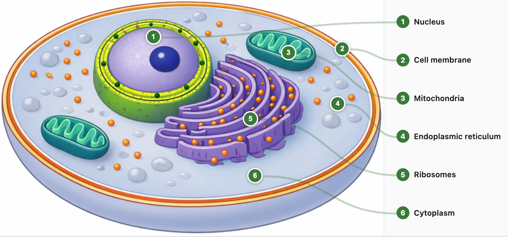

# Foundations of Interactive Infographics

## Summary

This chapter introduces the core vocabulary and concepts that underpin the entire course. You will learn the distinctions between static, animated, and interactive infographics, understand how MicroSims serve as the standard packaging for interactive content within intelligent textbooks, and explore the fundamental building blocks — iframes, regions, infoboxes, and event handlers — that make infographics interactive. By the end of this chapter, you will have a solid mental model of how interactive infographics fit into the broader landscape of educational technology.

## Concepts Covered

This chapter covers the following 20 concepts from the learning graph:

1. Infographic
2. Interactive Infographic
3. Static Infographic
4. Animated Infographic
5. Intelligent Textbook
6. MicroSim
7. MicroSim Architecture
8. Iframe Element
9. Width-Responsive Design
10. Central Content Area
11. Drawing Canvas
12. Infobox
13. Infobox Positioning
14. Region
15. Named Region
16. Region Label
17. Hover Event
18. Click Event
19. Selection Event
20. Event Handler

## Prerequisites

This chapter assumes only the prerequisites listed in the [course description](../../course-description.md). No prior chapters are required.

---

!!! mascot-welcome "Let's Make It Visual!"
    
    Welcome, visual thinkers! I'm Percy the Peacock, your guide through
    the world of interactive infographics. In this opening chapter, we'll
    build the vocabulary you need to design infographics that truly engage
    learners. Let's spread some knowledge!

## Why Interactive Infographics Matter

Imagine opening a textbook chapter on the human cell. In a traditional book, you see a static diagram with numbered labels pointing to parts of the cell.  It might look something like the following static image:



You read the labels, maybe memorize a few, and move on. Now imagine the same diagram where you can hover over the mitochondria and a detailed infobox appears describing its function, click on the nucleus to understand its function, you explore and then you drop directly into a quiz mode
where the infographic tests your knowledge of the parts of the cell.  This might work
like the following:

<iframe src="../../sims/animal-cell/main.html" width="100%" height="450px" scrolling="no"></iframe>

[Run the Animal Cell Interactive Infographic Fullscreen](../../sims/animal-cell/main.html)

But wait, there's more.  If you are curious about any component in the diagram
the infobox below the interactive diagram can lead you to another diagram
with details how that part of the cell works!

That is the transformative power of interactive infographics — they turn passive reading into active exploration.

Interactive infographics represent one of the most powerful tools available to instructional designers today. Research consistently shows that students who engage with interactive visual content demonstrate stronger conceptual understanding, longer retention, and greater motivation compared to those who study static materials alone. When learners can manipulate, explore, and experiment with visual representations of concepts, they build richer mental models that connect to their existing knowledge.

This chapter establishes the foundational concepts you need to create these transformative learning experiences. Whether you are building an interactive anatomy diagram for a biology course, a causal loop visualization for a business class, or a data-driven chart for a statistics lesson, the building blocks are the same: infographics, regions, events, and the packaging standards that make them deployable at scale.

## What Is an Infographic?

An **infographic** is a visual representation of information, data, or knowledge designed to present complex information quickly and clearly. The term combines "information" and "graphic" — and at its best, an infographic communicates in seconds what paragraphs of text might struggle to convey in minutes.

Infographics have been part of human communication for centuries, from cave paintings to Florence Nightingale's pioneering statistical diagrams in the 1850s. What has changed dramatically in recent decades is the medium: digital platforms now allow infographics to respond to user input, adapt to screen sizes, and track how students interact with them.

| Feature | Description | Example |
|---------|-------------|---------|
| Visual encoding | Uses shapes, colors, and positions to represent data | Bar height represents quantity |
| Information density | Communicates more per square inch than text alone | A network diagram showing 50 relationships |
| Cognitive efficiency | Leverages the brain's visual processing system | Color-coded categories recognized at a glance |
| Accessibility | Presents complex information to diverse audiences | A timeline making historical progression intuitive |

## The Three Types of Infographics

Not all infographics are created equal. Understanding the distinctions between static, animated, and interactive infographics helps you choose the right approach for each learning objective.

### Static Infographics

A **static infographic** is a fixed image — a PNG, JPEG, or SVG file that does not change or respond to user input. Traditional textbook diagrams, poster-style infographics shared on social media, and printed handouts are all static infographics. They are the simplest to create and the most widely used, but they have a fundamental limitation: they show one fixed view of the information.

Static infographics are effective when you need to convey a single, well-defined message. A comparison chart of three programming languages, a labeled diagram of a simple circuit, or a timeline of historical events can work beautifully as static images. However, when the information is complex, multi-layered, or best understood through exploration, static infographics fall short.

### Animated Infographics

An **animated infographic** adds movement and time-based transitions to the visual presentation. Animations can reveal information sequentially, draw attention to specific elements, or show processes that unfold over time. Animated GIFs, CSS animations, and video-based explainers are common formats.

Animation is particularly powerful for showing processes — how data flows through a pipeline, how a sorting algorithm rearranges elements, or how continental plates drift over millennia. However, animated infographics share a limitation with static ones: the viewer watches a predetermined sequence. They cannot pause at a moment of curiosity, explore a branch that interests them, or test a hypothesis by changing a variable.

### Interactive Infographics

An **interactive infographic** responds to user input in real time. When a learner hovers, clicks, drags, or adjusts a control, the infographic changes — revealing new information, highlighting relationships, or recalculating a visualization. This is where the magic happens for education.

Interactive infographics are qualitatively different from their static and animated cousins because they put the learner in control. Instead of consuming a predetermined narrative, students become active explorers. They can:

- Hover over a region to see detailed explanations without cluttering the main view
- Click elements to drill into related topics
- Adjust parameters (sliders, dropdowns) to see how changes affect outcomes
- Test their understanding by identifying unlabeled parts in quiz mode

| Type | User Control | Best For | Limitation |
|------|-------------|----------|------------|
| Static | None | Simple, single-message visuals | Cannot show multiple views or detail layers |
| Animated | Play/pause only | Processes and sequences | Fixed narrative, no exploration |
| Interactive | Full (hover, click, drag, adjust) | Complex, multi-layered concepts | Requires JavaScript and hosting |

### Quiz Mode

One of the most exciting capabilities of interactive infographics is that every diagram can instantly flip into a **quiz mode** — prompting the learner to identify a region by name rather than simply reading labels. This is a powerful example of content reuse without duplication: the same carefully designed diagram serves both as an instructional tool and as an assessment tool.

In quiz mode, the infographic hides the labels and presents a challenge: *"Click on the region called Mitochondria"* or *"Select the component responsible for data validation."* The learner must recall what they learned during exploration and demonstrate their understanding by clicking the correct region. Immediate visual feedback — a green highlight for correct, a gentle red flash for incorrect — reinforces learning in the moment.

This approach delivers several benefits:

- **Zero duplication** — one diagram serves both teaching and assessment, reducing maintenance and ensuring consistency
- **Active recall** — quiz mode forces retrieval practice, which research shows is one of the most effective strategies for long-term retention
- **Seamless transition** — a single toggle or button switches between explore mode and quiz mode, keeping the learner in context
- **Scalable assessment** — every labeled diagram in the textbook automatically becomes a potential quiz, dramatically expanding the pool of practice opportunities
- **Bloom's Taxonomy progression** — exploration targets *Remembering* and *Understanding*, while quiz mode pushes learners into *Applying* and *Analyzing*

| Mode | Labels Visible | User Action | Learning Objective |
|------|---------------|-------------|-------------------|
| Explore | Yes | Hover/click to learn | Remembering, Understanding |
| Quiz | Hidden | Click prompted region | Applying, Analyzing |

Because quiz mode reuses the exact same diagram, regions, and event handlers, adding assessment capability to an existing infographic requires minimal additional code — typically just a function that hides labels, selects a random region, and checks the learner's click against the target. This "build once, assess forever" pattern is one of the key reasons interactive infographics are so valuable in intelligent textbooks.

!!! mascot-thinking "Key Insight"
    
    The shift from static to interactive infographics mirrors a deeper shift
    in educational philosophy — from instructor-centered delivery to
    learner-centered exploration. When students control the visualization,
    they are not just viewing information; they are constructing understanding.

## Intelligent Textbooks: The Platform

An **intelligent textbook** is a web-based educational resource that goes far beyond digitized pages. Built on platforms like MkDocs Material and deployed through GitHub Pages, intelligent textbooks combine traditional written content with interactive simulations, learning graphs, glossaries, quizzes, and analytics — all in a responsive, searchable, and freely accessible format.

The key characteristics that make a textbook "intelligent" include:

- **Interactive content** embedded directly in chapters via iframes
- **Adaptive navigation** that guides students through concept dependencies
- **Learning analytics** that track how students interact with content
- **Open access** deployment on the web, removing cost barriers
- **Version control** enabling continuous improvement through community contributions

Interactive infographics are the visual heart of intelligent textbooks. They transform each chapter from a wall of text into an engaging, explorable learning environment. Every diagram, chart, and simulation you create in this course is designed to be embedded seamlessly within an intelligent textbook's chapter pages.

## MicroSims: The Standard Package

A **MicroSim** (short for Micro Simulation) is the standard packaging format for interactive content within intelligent textbooks. Think of a MicroSim as a self-contained interactive experience — a single HTML page with its own JavaScript, data files, and metadata — designed to be embedded in a textbook chapter via an iframe.

The **MicroSim architecture** follows a consistent pattern that makes interactive infographics modular, reusable, and maintainable:

```
docs/sims/my-infographic/
├── main.html         ← The interactive experience (HTML + JS)
├── index.md          ← Documentation page for the textbook
├── metadata.json     ← Dublin Core metadata for discoverability
└── data.json         ← Configuration data (optional)
```

Every MicroSim lives in its own directory under `docs/sims/`. The `main.html` file is the entry point — it contains (or references) all the HTML, CSS, and JavaScript needed to render the interactive infographic. The `index.md` file provides the MkDocs documentation page where the MicroSim is described and embedded. The `metadata.json` file stores Dublin Core metadata (title, creator, description, subject) that makes the MicroSim discoverable and catalogable.

This architecture is powerful because it enforces separation of concerns. The interactive experience is independent of the textbook framework — you can open `main.html` directly in a browser for testing, embed it in any web page, or package it for a learning management system. The standardization also means that generative AI tools can create MicroSims programmatically, dramatically accelerating production.

#### Diagram: MicroSim Architecture Overview

<iframe src="../../sims/microsim-architecture-overview/main.html" width="100%" height="500px" scrolling="no"></iframe>

<details markdown="1">
<summary>MicroSim Architecture Overview</summary>
Type: diagram
**sim-id:** microsim-architecture-overview<br/>
**Library:** p5.js<br/>
**Status:** Specified

**Bloom Level:** Understand (L2)
**Bloom Verb:** Explain
**Learning Objective:** Explain the four-file MicroSim architecture and how each file serves a distinct role in the packaging standard.

Instructional Rationale: A labeled block diagram helps learners visualize the relationship between the four files in a MicroSim directory. Hover-activated descriptions connect each file to its purpose without cluttering the initial view.

Visual elements:
- A directory tree on the left showing `docs/sims/my-infographic/` with four files
- Four colored blocks on the right, one per file:
  - `main.html` (blue) — "Interactive Experience: HTML + JavaScript"
  - `index.md` (green) — "Documentation: Textbook Page with Iframe Embed"
  - `metadata.json` (orange) — "Discoverability: Dublin Core Metadata"
  - `data.json` (purple) — "Configuration: Overlay Regions, Labels, Settings"
- Arrows showing how `index.md` embeds `main.html` via an iframe
- An arrow showing how `main.html` loads `data.json` at runtime
- A browser mockup at the top showing the final rendered result

Interactive features:
- Hover over each file block to see a detailed description of its contents and purpose
- Click a file block to highlight all arrows connected to that file

Canvas layout: Width-responsive, aliceblue background, minimum 600px width
Color scheme: Blue primary, orange accent (matching book theme)
</details>

## The Iframe Element: Embedding Interactive Content

The **iframe element** (`<iframe>`) is the HTML mechanism that makes MicroSim embedding possible. An iframe creates a rectangular window within a web page that loads and displays a separate HTML document. When you embed a MicroSim in a textbook chapter, the iframe acts as a portal — the chapter content flows around it while the interactive infographic runs independently inside it.

Here is a typical iframe embed in a chapter's markdown file:

```html
<iframe src="../../sims/cell-diagram/main.html"
        width="100%"
        height="600"
        scrolling="no"></iframe>
```

The `src` attribute points to the MicroSim's `main.html` file using a relative path. The `width="100%"` ensures the infographic fills the available content area. The `height` sets a fixed pixel height, and `scrolling="no"` prevents scroll hijacking that could disrupt the reading experience.

Iframes provide critical isolation: the MicroSim's JavaScript runs in its own execution context, so it cannot accidentally interfere with the textbook's navigation, styling, or other interactive elements. This isolation is what makes it safe to embed dozens of MicroSims from different authors across a single textbook.

## Width-Responsive Design

**Width-responsive design** ensures that interactive infographics look great and function correctly across a range of screen widths — from a 600-pixel mobile view to a 1,400-pixel desktop layout. In the context of intelligent textbooks, the infographic is displayed within the **central content area** of the page, which varies in width depending on the browser window and whether navigation sidebars are visible.

The standard responsive approach for MicroSims uses these conventions:

- The **drawing canvas** (the visual area where the infographic renders) occupies the full width of the iframe
- A `windowResized()` function recalculates the canvas dimensions whenever the browser window changes size
- Control elements (sliders, buttons, dropdowns) reflow into a column layout on narrow screens
- Text sizes scale proportionally to maintain readability

| Screen Width | Layout | Typical Context |
|-------------|--------|-----------------|
| 600-800 px | Compact, single column controls | Mobile phone, narrow browser |
| 800-1100 px | Standard, controls beside canvas | Tablet, typical laptop |
| 1100-1400 px | Expanded, full-width canvas | Desktop with sidebars open |

The **drawing canvas** is the rectangular area where visual elements are rendered, typically using an HTML5 `<canvas>` element (for p5.js) or SVG container (for D3.js). The canvas uses an `aliceblue` background color as a visual cue that distinguishes interactive content from the surrounding white page — students learn to recognize this subtle color as a signal that they can interact with the element.

!!! mascot-tip "Percy's Tip"
    
    Always test your infographics at both 600px and 1400px browser widths.
    A beautiful desktop visualization that breaks on mobile will frustrate
    half your students. The `windowResized()` function is your best friend.

## Regions and Labels: Defining Interactive Areas

At the heart of every interactive infographic is the concept of a **region** — a defined area within the visual that can respond to user interactions. Regions are what transform a static image into an interactive experience.

A **named region** is a region that has been assigned a human-readable identifier, such as "Mitochondria" or "Revenue Growth Loop." Named regions serve as the bridge between the visual representation and the educational content: when a student interacts with a named region, the system knows exactly which concept to display information about.

Each named region has a **region label** — a text string displayed on or near the region that identifies it. Labels can be:

- **Always visible** — printed directly on the infographic (useful for simple diagrams)
- **Numbered** — displayed as a circled number with a legend panel alongside the image
- **Hidden until interaction** — revealed when the student hovers or clicks (useful for quiz modes)

Regions can take different geometric shapes depending on the infographic type:

- **Rectangular regions** — simple axis-aligned boxes, ideal for non-overlapping areas
- **Polygon regions** — complex multi-point shapes that follow irregular boundaries
- **Circular regions** — defined by a center point and radius, used for callout markers

The region configuration is typically stored in a JSON file (`data.json` or `overlay.json`) that maps each named region to its coordinates, label text, and associated content:

```json
{
  "callouts": [
    {
      "id": 1,
      "label": "Mitochondria",
      "x": 65.2,
      "y": 43.8,
      "radius": 4.0,
      "description": "The powerhouse of the cell..."
    }
  ]
}
```

Notice that coordinates are stored as **percentages** (0-100) rather than pixel values. This percentage-based system is essential for width-responsive design — when the infographic scales to a different size, the regions scale proportionally.

## The Infobox: Delivering Content on Demand

An **infobox** is a content panel that appears when a student interacts with a region. It is the primary mechanism for progressive disclosure — the design pattern where details are hidden until the learner requests them, keeping the main view clean and uncluttered.

A well-designed infobox typically contains:

- The **region label** as a title (e.g., "Reinforcing Loop")
- A **description** of 2-5 sentences explaining the concept
- Optional additional content such as tips, common misconceptions, or exam relevance

**Infobox positioning** refers to where the infobox appears relative to the diagram. Common positioning strategies include:

- **Below the diagram** — the default for landscape-oriented images; the infobox occupies a fixed-height area beneath the visual, so it never overlaps the diagram content
- **Side panel** — a panel to the right of the diagram (ideal for wide screens) where the infobox content appears alongside the visual
- **Floating tooltip** — appears near the mouse cursor; compact but can obscure parts of the diagram

| Positioning | Pros | Cons | Best For |
|-------------|------|------|----------|
| Below diagram | Never obscures visual; predictable location | Requires scrolling on short screens | Landscape diagrams with detailed descriptions |
| Side panel | Always visible alongside diagram | Requires wide viewport | Desktop-first designs with many labels |
| Floating tooltip | Compact; appears right where attention is | Can obscure diagram content | Simple diagrams with short descriptions |

For intelligent textbooks, the **below-diagram** approach is recommended as the default because it works reliably across all screen sizes and never blocks the student's view of the infographic.

#### Diagram: Infobox Positioning Comparison

<iframe src="../../sims/infobox-positioning-comparison/main.html" width="100%" height="500px" scrolling="no"></iframe>

<details markdown="1">
<summary>Infobox Positioning Comparison</summary>
Type: infographic
**sim-id:** infobox-positioning-comparison<br/>
**Library:** p5.js<br/>
**Status:** Specified

**Bloom Level:** Analyze (L4)
**Bloom Verb:** Compare
**Learning Objective:** Compare the three infobox positioning strategies (below, side panel, floating tooltip) and identify which is most appropriate for different diagram layouts.

Instructional Rationale: A side-by-side interactive comparison lets learners directly experience each positioning strategy rather than just reading about them. Clicking through the three modes builds intuition for when each approach works best.

Visual elements:
- A sample diagram (simple labeled block diagram with 5 regions) displayed in the center
- Three toggle buttons at the top: "Below Diagram", "Side Panel", "Floating Tooltip"
- When each button is active, the infobox behavior changes accordingly:
  - Below: Infobox appears in a fixed area beneath the diagram
  - Side Panel: Infobox appears in a panel to the right of the diagram
  - Floating: Infobox appears as a tooltip near the hovered region
- A highlighted annotation explaining the current positioning mode

Interactive features:
- Click toggle buttons to switch between positioning modes
- Hover over any of the 5 regions to trigger the infobox in the current mode
- Each mode displays a brief pro/con note in the corner

Canvas layout: Width-responsive, aliceblue background, 600px minimum width
Color scheme: Blue regions, orange active highlights, white infobox with subtle shadow
</details>

## Events: How Infographics Respond to Users

Interactive infographics come alive through **events** — signals generated when a user performs an action. The three fundamental event types are hover, click, and selection.

### Hover Events

A **hover event** fires when the user moves the mouse cursor over a region (or taps and holds on a touch device). Hover is the most common interaction in educational infographics because it is lightweight and reversible — the student does not commit to anything by hovering. Information appears and disappears naturally as the cursor moves.

Hover events are ideal for:

- Displaying infobox descriptions
- Highlighting connected elements (e.g., glowing a label when its region is hovered)
- Showing tooltips with brief definitions

### Click Events

A **click event** fires when the user presses and releases the mouse button (or taps on a touch device) over a region. Click events signal intentional action and are appropriate for:

- Toggling between states (e.g., switching from Explore mode to Quiz mode)
- Selecting a region for deeper exploration
- Submitting a quiz answer (e.g., "Click the correct organelle")
- Navigating to related content

### Selection Events

A **selection event** is a higher-level concept that captures when a student has chosen a specific item from a set of options. While hover and click are raw browser events, selection represents a meaningful educational action — the student has made a decision. Selection events are particularly important for:

- Quiz interactions where the student identifies the correct answer
- Classification activities where items are sorted into categories
- Multi-step explorations where each selection reveals the next layer

### Event Handlers

An **event handler** is a JavaScript function that runs in response to an event. Event handlers are the glue between user actions and infographic responses. When a student hovers over a named region, the event handler:

1. Identifies which region was hovered (using hit detection)
2. Looks up the associated content (from the JSON data file)
3. Updates the display (shows the infobox, highlights the region)

```javascript
function mouseMoved() {
  for (let region of regions) {
    if (region.contains(mouseX, mouseY)) {
      showInfobox(region.label, region.description);
      highlightRegion(region);
      return;
    }
  }
  hideInfobox();
}
```

This pattern — detect the event, identify the target, update the display — is the same whether you are building a simple labeled diagram or a complex polygon overlay with dozens of interactive regions.

!!! mascot-thinking "Key Insight"
    
    Every interactive infographic in this course follows the same
    fundamental loop: **Event → Identify Region → Update Display**.
    Once you internalize this pattern, you can build any type of
    interactive visualization — from simple hover labels to complex
    multi-mode explorations.

#### Diagram: Event Handling Flow

<iframe src="../../sims/event-handling-flow/main.html" width="100%" height="500px" scrolling="no"></iframe>

<details markdown="1">
<summary>Event Handling Flow</summary>
Type: diagram
**sim-id:** event-handling-flow<br/>
**Library:** p5.js<br/>
**Status:** Specified

**Bloom Level:** Understand (L2)
**Bloom Verb:** Explain
**Learning Objective:** Explain the three-step event handling pattern (detect event, identify region, update display) that drives all interactive infographics.

Instructional Rationale: A step-through flowchart with concrete examples at each stage helps learners trace the process with real data. Stepping through each phase builds understanding of the event → response pipeline.

Visual elements:
- A horizontal flowchart with three main stages:
  1. "Event Detected" (blue box) — shows icons for Hover, Click, and Selection
  2. "Region Identified" (orange box) — shows hit detection checking mouse coordinates against region boundaries
  3. "Display Updated" (green box) — shows infobox appearing and region highlighting
- Arrows connecting the three stages with labeled transitions
- Below the flowchart, a live demo area with a small sample diagram (3 regions)
- When the user interacts with the sample diagram, the corresponding flowchart stage lights up in real time

Interactive features:
- Hover over the sample diagram regions to see the flowchart stages highlight in sequence
- Click a flowchart stage to see a detailed explanation of what happens at that step
- A "Slow Motion" toggle that adds a visible delay between stages so students can observe the sequence

Canvas layout: Width-responsive, aliceblue background
Color scheme: Blue for events, orange for processing, green for output
</details>

## Putting It All Together: From Concept to Experience

Let's trace how all these concepts work together in a real educational scenario. Suppose you are an instructional designer building an interactive diagram of the water cycle for an earth science textbook.

1. **You create an infographic** — a visual illustration of the water cycle showing clouds, rain, rivers, oceans, and evaporation arrows
2. **You define named regions** — "Evaporation," "Condensation," "Precipitation," "Collection," and "Transpiration" are each assigned polygon boundaries that follow the visual shapes in the illustration
3. **Each region gets a label** — numbered indicators (1-5) appear on the diagram with a legend panel listing the region names
4. **You write infobox content** — each named region has a 2-3 sentence description explaining the process it represents
5. **You configure infobox positioning** — the infobox appears below the diagram so it never obscures the visual
6. **Event handlers connect everything** — hover events trigger the infobox display; click events in quiz mode let students identify processes by clicking the correct region
7. **You package it as a MicroSim** — `main.html`, `index.md`, `metadata.json`, and `data.json` go into `docs/sims/water-cycle/`
8. **You embed it via an iframe** — a single line in the chapter markdown brings the interactive experience into the textbook

The result is an interactive learning experience where students explore the water cycle at their own pace, hover to read about each process, and test themselves in quiz mode — all within the flow of their reading.

!!! mascot-celebration "Excellent Progress!"
    
    You now have a complete vocabulary for interactive infographic design!
    From infographics and regions to events and MicroSims, you understand
    the building blocks that power every interactive visualization in this
    course. Display it with style!

## Key Takeaways

- An **infographic** is a visual representation of information; interactive infographics respond to user input in real time, making them dramatically more effective for learning than static alternatives
- **Intelligent textbooks** are web-based educational platforms that embed interactive content, track engagement, and support learner-centered exploration
- **MicroSims** are the standard packaging format: self-contained directories with `main.html`, `index.md`, `metadata.json`, and optionally `data.json`
- The **iframe element** embeds MicroSims into textbook chapters while providing isolation between the interactive content and the page framework
- **Width-responsive design** ensures infographics work across screen sizes from 600px to 1,400px, with the **drawing canvas** using an `aliceblue` background as a visual interaction cue
- **Regions** define interactive areas; **named regions** with **labels** connect visual elements to educational content
- **Infoboxes** deliver content on demand through progressive disclosure, with **below-diagram** positioning recommended as the default
- Three event types — **hover**, **click**, and **selection** — drive all interactivity, handled by **event handler** functions that follow the pattern: detect event → identify region → update display

??? question "Self-Check: Can you explain the MicroSim architecture?"
    A MicroSim directory contains four files: `main.html` (the interactive experience), `index.md` (the documentation page), `metadata.json` (Dublin Core metadata for discoverability), and `data.json` (optional configuration data for regions, labels, and settings). The `main.html` file is embedded in the textbook chapter via an `<iframe>` element.

[See Annotated References](./references.md)
