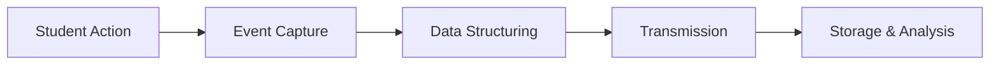

# Tracking, Analytics, and Deployment

## Summary

This chapter covers the final stages of the infographic lifecycle: tracking student interactions, analyzing engagement data, and deploying your intelligent textbook to the web. You will learn xAPI event logging, interaction tracking, engagement metrics (click heatmaps, session duration, completion rates), A/B testing, and usability testing. The deployment section covers Markdown authoring, MkDocs configuration, GitHub Pages deployment, Git version control, CI/CD with GitHub Actions, and site features like search, social cards, and admonition blocks.

## Concepts Covered

This chapter covers the following 35 concepts from the learning graph:

1. xAPI Protocol
2. Experience API
3. Event Logging
4. Interaction Tracking
5. Student Engagement Data
6. Learning Analytics
7. Lesson Plan Section
8. References Section
9. MkDocs Material Theme
10. GitHub Pages Deployment
11. Instructor Dashboard
12. Click Heatmap
13. Engagement Metrics
14. Session Duration
15. Completion Rate
16. A/B Testing
17. User Feedback Loop
18. Iterative Design
19. Usability Testing
20. Markdown Format
21. MkDocs Build Process
22. mkdocs.yml Configuration
23. Navigation Structure
24. Site Search
25. Social Cards Plugin
26. Custom CSS Override
27. Admonition Block
28. Code Block
29. Mermaid Diagram
30. Git Version Control
31. GitHub Repository
32. Pull Request
33. GitHub Actions
34. Continuous Deployment
35. Branch Strategy

## Prerequisites

This chapter builds on concepts from:

- [Chapter 1: Foundations of Interactive Infographics](../01-foundations-of-interactive-infographics/index.md)
- [Chapter 10: MicroSim Standards and Packaging](../10-microsim-standards-and-packaging/index.md)

---

!!! mascot-welcome "Let's Spread Some Knowledge!"
    
    Welcome to the chapter where everything comes together! You have spent this course learning to design, build, and refine interactive infographics — and now it is time to ship them to the world and learn from how students actually use them. Tracking, analytics, and deployment are not afterthoughts — they are what transform a collection of MicroSims into a living, improving intelligent textbook. This chapter gives you the tools to publish with confidence and iterate with data. Let's spread some knowledge!

## Learning Objectives

By the end of this chapter, you will be able to:

- **Explain** how the xAPI protocol and Experience API enable standardized tracking of student interactions across interactive infographics and learning systems (Bloom: Understand)
- **Implement** event logging for hover, click, and selection interactions within a MicroSim, capturing student engagement data for analysis (Bloom: Apply)
- **Analyze** engagement metrics including click heatmaps, session duration, and completion rates to identify which infographic elements are most and least effective (Bloom: Analyze)
- **Evaluate** the effectiveness of interactive infographic designs through A/B testing and usability testing methodologies, applying iterative design principles to improve learning outcomes (Bloom: Evaluate)
- **Deploy** an intelligent textbook built with MkDocs Material to GitHub Pages using Git version control, CI/CD with GitHub Actions, and proper branch strategy (Bloom: Apply)

## Introduction

Creating an interactive infographic is only half the story. The other half — and arguably the more valuable half — is understanding how students actually interact with your content, learning from that data, and continuously improving your designs. This chapter bridges the gap between creation and impact.

The chapter unfolds in three interconnected arcs. First, you will learn the tracking and event logging infrastructure that captures student interactions as structured data. Second, you will explore the analytics and testing methodologies that transform raw interaction data into actionable design insights. Third, you will master the deployment pipeline that publishes your intelligent textbook to the web and keeps it updated through automated workflows. Together, these three arcs complete the lifecycle of an interactive infographic — from creation through deployment to continuous improvement.

This is an empowering chapter because the skills you learn here give you ongoing leverage. Every infographic you publish with proper tracking generates data that informs better designs. Every deployment you automate saves hours of manual work. Every A/B test you run replaces guesswork with evidence. The result is a virtuous cycle where your infographics get better over time, not just when you have time to work on them.

## Student Interaction Tracking

### xAPI Protocol and the Experience API

The **xAPI protocol** (also called the **Experience API** or Tin Can API) is an open standard for recording and sharing learning experiences. xAPI provides a consistent format for describing what a learner did, with what, and in what context — enabling learning analytics across diverse platforms, tools, and content types.

At its core, xAPI uses a simple **Actor-Verb-Object** sentence structure:

- **Actor**: The student (identified by email, account, or anonymous ID)
- **Verb**: The action performed (e.g., "experienced", "completed", "answered", "interacted")
- **Object**: The content interacted with (e.g., a specific MicroSim, a particular overlay region)

A typical xAPI statement for an interactive infographic interaction might look like:

```json
{
  "actor": {
    "mbox": "mailto:student@university.edu",
    "name": "Student A"
  },
  "verb": {
    "id": "http://adlnet.gov/expapi/verbs/interacted",
    "display": { "en-US": "interacted" }
  },
  "object": {
    "id": "https://textbook.example.com/sims/cell-biology-overlay",
    "definition": {
      "name": { "en-US": "Cell Biology Overlay Infographic" },
      "type": "http://adlnet.gov/expapi/activities/media"
    }
  },
  "result": {
    "extensions": {
      "region_id": "mitochondria",
      "interaction_type": "hover",
      "duration_ms": 3200
    }
  },
  "timestamp": "2026-03-14T14:32:15Z"
}
```

The xAPI standard is valuable for interactive infographics because it enables tracking at a granular level — not just "the student viewed the page" but "the student hovered over the mitochondria region for 3.2 seconds, then clicked the nucleus region, then spent 8 seconds reading the nucleus infobox." This level of detail reveals how students actually engage with interactive content.

| xAPI Component | Purpose | Example for Infographics |
|---------------|---------|--------------------------|
| **Actor** | Identifies the learner | Anonymous ID or authenticated user |
| **Verb** | Describes the action | interacted, completed, answered, experienced |
| **Object** | Identifies the content | MicroSim URL, region ID, control name |
| **Result** | Records outcome details | Hover duration, click target, selected options |
| **Context** | Provides situational info | Chapter, lesson, device type, session ID |
| **Timestamp** | Records when it happened | ISO 8601 date-time |

### Event Logging

**Event logging** is the process of capturing and recording user interactions as they occur. In the context of interactive infographics, event logging captures every hover, click, and selection event, creating a chronological record of the student's interaction journey.

Implementing event logging in a MicroSim involves three steps:

1. **Capture events**: Add event listeners for hover, click, and selection interactions in your JavaScript code
2. **Structure the data**: Format each event with consistent fields (event type, target element, timestamp, duration)
3. **Transmit the data**: Send event records to a collection endpoint (an xAPI Learning Record Store, a simple analytics API, or even the browser's localStorage for offline collection)

A practical event logging implementation for a p5.js MicroSim:

```javascript
// Event logging utility for MicroSim interactions
const eventLog = [];

function logEvent(eventType, targetId, details = {}) {
  const event = {
    type: eventType,        // "hover", "click", "select"
    target: targetId,       // "region-mitochondria", "slider-speed"
    timestamp: Date.now(),
    details: details        // {duration_ms: 3200, value: 0.75}
  };
  eventLog.push(event);

  // Send to parent frame for collection
  window.parent.postMessage({
    type: 'microsim-event',
    event: event
  }, '*');
}
```

### Interaction Tracking

**Interaction tracking** builds on event logging by organizing raw events into meaningful interaction sequences. While event logging records individual events, interaction tracking aggregates them into higher-level behaviors: "The student explored all five regions," "The student adjusted the slider 12 times," or "The student spent 80% of their time on the first two regions."

Key interaction metrics to track:

- **Region coverage**: Which interactive regions has the student explored? (hover or click count per region)
- **Exploration depth**: How much time did the student spend with each region's detail content?
- **Control usage**: Which sliders, buttons, or toggles did the student adjust, and how many times?
- **Sequence patterns**: In what order did the student explore the content? Did they follow the intended pedagogical sequence?
- **Return visits**: Did the student revisit specific regions, suggesting confusion or deep interest?

#### Diagram: Event Logging Flow Visualization

<iframe src="../../sims/event-logging-flow/main.html" width="100%" height="550px" scrolling="no"></iframe>

<details markdown="1">
<summary>Event Logging Flow Visualization</summary>
Type: microsim
**sim-id:** event-logging-flow<br/>
**Library:** p5.js<br/>
**Status:** Specified

**Bloom Level:** Understand (L2)
**Bloom Verb:** Describe
**Learning Objective:** Describe the flow of interaction events from a student's action through event capture, logging, transmission, and storage by stepping through a worked example that shows concrete data at each stage of the pipeline.

**Instructional Rationale:** A step-through with worked examples showing concrete data at each stage is appropriate because the Understand objective requires learners to trace the complete event logging pipeline. Seeing actual event data as it transforms through each stage builds a clear mental model of the system.

**Canvas Layout:**
- Main area (aliceblue): a horizontal pipeline diagram with 5 stages, each showing a data transformation
- Below (white, silver border): a detail panel showing the data at the currently selected stage

**Visual Elements:**
- 5 pipeline stages displayed as connected rounded rectangles:
  1. "Student Action" (purple) — shows a hand icon clicking on a diagram region
  2. "Event Capture" (blue) — shows a JavaScript event listener firing
  3. "Data Structuring" (green) — shows raw event data being formatted into a JSON object
  4. "Transmission" (orange) — shows postMessage sending data to the parent frame
  5. "Storage & Analysis" (teal) — shows data arriving in a Learning Record Store
- Arrows between stages with small data preview labels
- A sample MicroSim in the top-left corner (3 clickable colored rectangles) that generates real events when the student interacts with it
- A "Live Event Stream" panel on the right showing timestamped events as they are generated

**Data Visibility Requirements:**
Stage 1: Show "Student clicked region 'Nucleus' at position (245, 180)"
Stage 2: Show JavaScript event object: {type: "click", clientX: 245, clientY: 180, target: "canvas"}
Stage 3: Show structured log entry: {type: "click", target: "nucleus", timestamp: 1710423135000, details: {x: 0.41, y: 0.30}}
Stage 4: Show postMessage payload: {type: "microsim-event", event: {type: "click", target: "nucleus", ...}}
Stage 5: Show xAPI statement: {actor: {...}, verb: "interacted", object: "cell-biology-overlay", result: {region: "nucleus"}}

**Interactive Controls:**
- The sample MicroSim generates real events when hovered or clicked
- Button: "Next Stage" / "Previous Stage" — steps through the pipeline one stage at a time
- Button: "Clear Events" — clears the live event stream
- Toggle: "Auto-Advance" (default off) — automatically advances to the next stage when a new event is generated
- Dropdown: "Event Type" — filter the live stream by hover, click, or all events

**Behavior:**
- Interacting with the sample MicroSim generates real events that appear in the live stream
- Stepping through stages shows how the same event data transforms at each pipeline stage
- The detail panel displays formatted data with syntax highlighting
- New events appear at the top of the live stream with a brief highlight animation
- Responsive to window resize

**Default Parameters:**
- Stage 1 selected
- Auto-Advance: off
- Event filter: all
- Canvas width: responsive
- Canvas height: 500px

Implementation: p5.js with event capture demonstration and pipeline visualization
</details>

## Engagement Metrics and Analytics

### Student Engagement Data

**Student engagement data** is the collection of quantitative and qualitative measurements that describe how students interact with educational content. For interactive infographics, engagement data includes event counts, interaction durations, coverage percentages, and behavioral patterns that collectively reveal whether students are engaged, confused, or disinterested.

Engagement data falls into three categories:

- **Behavioral data**: What the student did (clicks, hovers, scrolls, time on page)
- **Outcome data**: What the student achieved (quiz scores, completion status, correct identifications)
- **Contextual data**: The conditions of the interaction (device type, time of day, session number, referring page)

### Learning Analytics

**Learning analytics** is the measurement, collection, analysis, and reporting of data about learners and their contexts, with the purpose of understanding and optimizing learning and the environments in which it occurs. For interactive infographics, learning analytics transforms raw engagement data into insights that inform design improvements.

Key learning analytics questions for infographic designers:

- **Which regions receive the most attention?** — Helps identify the content students find most interesting or confusing
- **Where do students drop off?** — Reveals content that is too complex, too boring, or poorly positioned
- **Do students who interact more score higher?** — Validates whether the interactive elements actually contribute to learning
- **Which interaction patterns correlate with better outcomes?** — Identifies the most effective ways students use the infographic

### Engagement Metrics

**Engagement metrics** are specific, quantifiable measurements derived from student engagement data. The most valuable engagement metrics for interactive infographics include:

| Metric | What It Measures | What It Reveals |
|--------|-----------------|-----------------|
| **Click Heatmap** | Spatial distribution of clicks | Which areas attract interaction; whether students find interactive regions |
| **Session Duration** | Total time spent with the infographic | Overall engagement level; whether content holds attention |
| **Completion Rate** | Percentage of regions/steps explored | Whether students explore all content or abandon partway |
| **Hover Duration** | Time spent reading each tooltip/infobox | Which descriptions students find valuable; which they skip |
| **Return Rate** | Frequency of revisiting specific regions | Confusion (repeated returns) or deep interest |
| **Interaction Sequence** | Order of region exploration | Whether students follow the intended learning path |

### Click Heatmap

A **click heatmap** is a visual overlay that shows where students click most frequently on an infographic, using color intensity to represent click density. Areas with many clicks appear as "hot" zones (typically red or orange), while areas with few or no clicks appear as "cold" zones (blue or transparent).

Click heatmaps are powerful diagnostic tools because they reveal:

- **Discovered vs. undiscovered regions**: If a region receives zero clicks, students may not realize it is interactive
- **Misclick patterns**: Clusters of clicks on non-interactive areas suggest that students expect interactivity where none exists
- **Engagement distribution**: An even heat distribution suggests balanced exploration; concentrated heat suggests one dominant region

### Session Duration

**Session duration** measures the total time a student spends interacting with an infographic in a single session. Session duration is a proxy for engagement — longer sessions generally indicate that students are exploring the content rather than bouncing away. However, extremely long sessions may indicate confusion rather than engagement, so session duration should always be interpreted alongside other metrics.

### Completion Rate

**Completion rate** measures the percentage of available interactive elements that a student explored during their session. For an overlay infographic with 8 regions, a student who hovered over or clicked 6 of them has a completion rate of 75%. High completion rates suggest that the infographic successfully motivates exploration; low completion rates suggest that students either lose interest or cannot find all interactive elements.

!!! mascot-thinking "Key Insight"
    
    No single engagement metric tells the complete story. A high session duration with a low completion rate might mean the student found one region fascinating and ignored the rest — or it might mean they were confused and stuck. Always analyze multiple metrics together: session duration, completion rate, click distribution, and hover patterns. The combination reveals the full picture of student engagement.

### Instructor Dashboard

An **instructor dashboard** is a web-based interface that aggregates and displays learning analytics for an educator, providing at-a-glance visibility into how students are engaging with interactive content. For an intelligent textbook with dozens of MicroSim infographics, the instructor dashboard answers critical questions: Which infographics are most used? Where do students struggle? Which content needs revision?

A well-designed instructor dashboard includes:

- **Overview metrics**: Total sessions, unique students, average session duration, average completion rate across all infographics
- **Per-infographic views**: Drill-down into individual MicroSim performance with click heatmaps and engagement charts
- **Trend analysis**: Engagement metrics over time, showing whether changes to content improve or degrade student interaction
- **Alert indicators**: Flagging infographics with unusually low completion rates or high bounce rates
- **Cohort comparison**: Comparing engagement between student groups, sections, or semesters

#### Diagram: Engagement Metrics Dashboard

<iframe src="../../sims/engagement-metrics-dashboard/main.html" width="100%" height="600px" scrolling="no"></iframe>

<details markdown="1">
<summary>Engagement Metrics Dashboard</summary>
Type: microsim
**sim-id:** engagement-metrics-dashboard<br/>
**Library:** Chart.js<br/>
**Status:** Specified

**Bloom Level:** Analyze (L4)
**Bloom Verb:** Examine
**Learning Objective:** Examine simulated engagement metrics (click heatmaps, session duration distribution, completion rates, interaction sequences) for a sample set of interactive infographics, identifying which infographics perform well and which need redesign based on the data patterns.

**Instructional Rationale:** An interactive dashboard with simulated analytics data is appropriate because the Analyze objective requires learners to examine multiple data streams and draw conclusions. Working with realistic sample data teaches the analytical mindset needed for continuous improvement.

**Canvas Layout:**
- Top row (aliceblue): 4 metric cards showing aggregate statistics (Total Sessions, Avg Duration, Avg Completion, Active Students)
- Middle area (aliceblue): two chart panels side by side
- Bottom area (white, silver border): per-infographic detail table with sortable columns

**Visual Elements:**
- **Metric cards** (top row): 4 rounded rectangles with large numbers:
  - Total Sessions: 2,847
  - Avg Session Duration: 4m 32s
  - Avg Completion Rate: 73%
  - Active Students (30 days): 156
- **Left chart**: Bar chart showing completion rate for 8 sample infographics, with bars colored green (>80%), yellow (60-80%), or red (<60%)
- **Right chart**: Line chart showing daily session count over 30 days, with a trend line
- **Detail table**: Sortable table with columns:
  - Infographic Name
  - Sessions
  - Avg Duration
  - Completion Rate
  - Click Coverage (percentage of regions clicked)
  - Top Region (most-clicked region name)
  - Status (green dot, yellow dot, red dot)
- Sample data for 8 infographics across different chapters, with realistic variation in metrics

**Interactive Controls:**
- Click any bar in the completion rate chart to select that infographic and update the detail panel
- Dropdown: "Time Period" — Last 7 days, Last 30 days, Last 90 days, All Time
- Dropdown: "Sort By" — Sessions, Duration, Completion Rate, Click Coverage
- Toggle: "Show Trend Lines" (default on) — adds/removes trend lines on charts
- Button: "Export Data" — copies the dashboard data as a CSV-formatted string
- Click column headers in the detail table to sort ascending/descending

**Behavior:**
- Selecting a time period regenerates all charts and metrics with period-appropriate simulated data
- Clicking a bar chart element highlights the corresponding row in the detail table
- Sorting the table re-renders with smooth row transitions
- Metric cards animate when values change (counting up/down to new values)
- Responsive: charts stack vertically on narrow screens

**Default Parameters:**
- Time Period: Last 30 days
- Sort By: Completion Rate (descending)
- Show Trend Lines: on
- Canvas width: responsive
- Canvas height: 550px

Implementation: Chart.js for charts, HTML table for detail view, simulated analytics data
</details>

## Testing and Iterative Improvement

### A/B Testing

**A/B testing** (also called split testing) is a methodology for comparing two versions of the same content to determine which performs better. In the context of interactive infographics, A/B testing means showing different students different versions of the same infographic and measuring which version produces better engagement metrics, learning outcomes, or both.

Practical A/B testing scenarios for interactive infographics:

- **Layout comparison**: Does a horizontal layout or vertical layout produce higher completion rates?
- **Interaction pattern comparison**: Does step-reveal or free exploration lead to better learning outcomes?
- **Color scheme comparison**: Does a sequential color palette or categorical palette help students distinguish regions more quickly?
- **Tooltip content comparison**: Do shorter, punchier descriptions or longer, more detailed descriptions produce longer hover durations?
- **Control placement comparison**: Does placing controls above or below the visualization reduce confusion?

The A/B testing workflow:

1. **Formulate a hypothesis**: "Students will achieve higher completion rates with step-reveal navigation than free exploration"
2. **Create two versions**: Version A (free exploration) and Version B (step reveal)
3. **Randomly assign students**: Each student sees only one version
4. **Collect data**: Track engagement metrics for both groups over a defined period
5. **Analyze results**: Compare metrics between groups using statistical tests to confirm the difference is meaningful
6. **Implement the winner**: Adopt the version that performed better, then test the next hypothesis

### User Feedback Loop

A **user feedback loop** is a systematic process for collecting, analyzing, and acting on feedback from students and instructors who use the interactive content. While analytics data reveals *what* students do, feedback reveals *why* they do it — and what they wish were different.

Feedback collection methods for interactive infographics:

- **In-line feedback**: A small "Was this helpful?" prompt after completing an infographic, with optional text input
- **Survey instruments**: End-of-chapter or end-of-course surveys asking about specific infographic experiences
- **Observation notes**: Instructors recording student reactions and questions during classroom use
- **Support requests**: Tracking questions or confusion reports related to specific infographics

### Usability Testing

**Usability testing** is the practice of observing real users as they interact with your content, identifying points of confusion, frustration, or delight. For interactive infographics, usability testing reveals problems that analytics alone cannot detect — such as unclear instructions, counterintuitive interactions, or visual elements that students misinterpret.

A lightweight usability testing protocol for interactive infographics:

1. **Recruit 3-5 representative users** (students who match the target audience)
2. **Define tasks**: "Explore this infographic and tell me what the mitochondria does," or "Find the region with the highest value"
3. **Observe silently**: Watch and take notes as the student interacts; do not guide or correct
4. **Ask follow-up questions**: "What was confusing?", "What did you expect to happen when you clicked there?"
5. **Identify patterns**: Look for issues that multiple users encounter — these are systematic design problems
6. **Prioritize fixes**: Address the most impactful issues first

### Iterative Design

**Iterative design** is the philosophy of continuously improving content through cycles of creation, testing, measurement, and refinement. Rather than attempting to create a perfect infographic on the first try, iterative design embraces the reality that the first version is always a hypothesis — and each round of feedback and analytics data brings the design closer to optimal.

The iterative design cycle for interactive infographics:

1. **Create** the initial infographic based on learning objectives and design principles
2. **Deploy** to the intelligent textbook
3. **Collect** engagement data and user feedback
4. **Analyze** metrics and identify improvement opportunities
5. **Refine** the design based on evidence
6. **Redeploy** the improved version
7. **Repeat** the cycle

!!! mascot-thinking "Key Insight"
    
    Iterative design is the most optimistic approach to content creation because it removes the pressure of perfection. Your first version does not need to be flawless — it needs to be good enough to generate useful data. Every analytics report and every usability test gives you specific, actionable guidance for improvement. The infographics that ultimately perform best are rarely the ones that were perfect on day one — they are the ones whose creators kept iterating based on real student data.

## Documentation for Intelligent Textbooks

### Lesson Plan Section

The **lesson plan section** is a structured component of a MicroSim's `index.md` documentation that describes how an instructor should integrate the infographic into a classroom lesson. A well-written lesson plan section transforms a standalone infographic into a pedagogically contextualized learning activity.

Key elements of a lesson plan section:

- **Learning objective**: What students should be able to do after completing the activity
- **Prerequisites**: What students should already know before engaging with the infographic
- **Setup instructions**: How to present the infographic (full screen, embedded in slides, student self-paced)
- **Activity sequence**: Step-by-step instructions for the classroom activity (5-10 minutes typically)
- **Discussion prompts**: Questions to ask students after they interact with the infographic
- **Assessment suggestions**: How to verify that students achieved the learning objective

### References Section

The **references section** provides links to authoritative sources that the infographic content is based on. For educational content, references serve dual purposes: they establish credibility and they provide students with paths for deeper exploration.

Effective references for MicroSim infographics:

- Link to the Wikipedia article for core concepts (reliable, always available, well-maintained)
- Link to primary sources for data-driven visualizations
- Link to documentation for technical tools used (p5.js reference, xAPI specification)
- Include 5-10 references per MicroSim, prioritizing accessibility and reliability

## Markdown Authoring for MkDocs

### Markdown Format

**Markdown format** is a lightweight markup language that uses plain-text formatting conventions to produce structured documents. Markdown is the authoring language for MkDocs-based intelligent textbooks — every chapter, MicroSim documentation page, glossary entry, and reference section is written in Markdown.

Markdown advantages for educational content:

- **Readable as plain text**: Authors can read and edit Markdown without a preview tool
- **Version-control friendly**: Markdown files produce clean diffs in Git, making collaboration straightforward
- **Extensible**: MkDocs Material extends standard Markdown with admonitions, tabs, code annotations, and more
- **Separates content from presentation**: The same Markdown renders differently depending on the theme, enabling design updates without content changes

### Admonition Block

An **admonition block** is a visually distinct callout box used to highlight notes, warnings, tips, or other special content within a Markdown page. MkDocs Material provides a rich set of admonition types that map directly to common educational content patterns.

Common admonition types and their educational uses:

| Admonition Type | Keyword | Best For |
|----------------|---------|----------|
| **Note** | `!!! note` | General supplementary information |
| **Tip** | `!!! tip` | Helpful shortcuts or best practices |
| **Warning** | `!!! warning` | Common mistakes or important cautions |
| **Example** | `!!! example` | Worked examples or demonstrations |
| **Question** | `!!! question` | Reflection questions for students |
| **Success** | `!!! success` | Correct answers or achievement confirmations |
| **Info** | `!!! info` | Background context or definitions |
| **Abstract** | `!!! abstract` | Chapter or section summaries |

Admonitions are created with a simple syntax:

```markdown
!!! tip "Design Best Practice"
    Always test your infographic at three viewport widths
    (360px, 768px, 1200px) before deploying.
```

Collapsible admonitions use `???` instead of `!!!` and are excellent for self-assessment questions where students can check their answer by expanding the block.

### Code Block

A **code block** is a formatted section of Markdown that displays source code with syntax highlighting, line numbers, and optional annotations. Code blocks are essential for educational content that teaches programming concepts — they present code in a readable, copy-friendly format.

MkDocs Material code blocks support:

- Language-specific syntax highlighting (JavaScript, JSON, HTML, CSS, Python)
- Line number display
- Line highlighting to draw attention to specific lines
- Title bars showing filenames
- Copy buttons for one-click code copying
- Annotations that appear as numbered callouts within code

### Mermaid Diagram

A **Mermaid diagram** is a text-based diagram generated from a simple markup language embedded directly in Markdown. Mermaid supports flowcharts, sequence diagrams, Gantt charts, class diagrams, and more — all rendered as SVG graphics from plain-text descriptions.

Mermaid is valuable for educational content because diagrams can be authored, versioned, and modified using the same text-based workflow as the rest of the content. No separate drawing tool is needed.

```markdown


Mermaid diagrams are rendered automatically by MkDocs Material when the `pymdownx.superfences` extension is configured with Mermaid support.

## MkDocs Configuration and Site Features

### MkDocs Material Theme

The **MkDocs Material theme** is a feature-rich documentation theme for MkDocs that provides the visual design, navigation, search, and interactive features used by intelligent textbooks. MkDocs Material transforms plain Markdown files into a polished, responsive website with professional typography, navigation, and search functionality.

Key MkDocs Material features for intelligent textbooks:

- **Responsive design**: Automatically adapts to desktop, tablet, and mobile screen sizes
- **Dark/light mode**: Supports both color schemes with user toggle
- **Integrated search**: Full-text search across all pages with instant results
- **Social cards**: Automatically generates Open Graph preview images for social media sharing
- **Admonition styling**: Beautiful callout boxes with icons and colors
- **Code highlighting**: Syntax highlighting for 200+ programming languages
- **Navigation**: Sidebar navigation with expandable sections, table of contents, and breadcrumbs

### MkDocs Build Process

The **MkDocs build process** transforms a directory of Markdown files, configuration, and assets into a static HTML website. Understanding the build process helps you diagnose issues, optimize performance, and customize output.

The build pipeline:

1. **Read configuration**: MkDocs reads `mkdocs.yml` for site settings, theme options, plugins, and navigation structure
2. **Process Markdown**: Each `.md` file is parsed, extensions are applied (admonitions, code blocks, Mermaid), and HTML is generated
3. **Apply theme**: The Material theme wraps each page in navigation, headers, footers, and search infrastructure
4. **Copy assets**: CSS, JavaScript, images, and MicroSim directories are copied to the output
5. **Generate extras**: Search index, sitemap, social cards, and other plugin outputs are created
6. **Output**: The complete static site is written to the `site/` directory

Two essential commands:

- `mkdocs serve` — Starts a local development server with live reload (changes appear instantly)
- `mkdocs build` — Generates the complete static site for deployment

### mkdocs.yml Configuration

The **mkdocs.yml configuration** file is the central control file for an MkDocs site. It defines the site name, theme settings, navigation structure, Markdown extensions, plugins, and custom CSS/JavaScript files.

Key configuration sections for intelligent textbooks:

```yaml
site_name: Interactive Infographics for Intelligent Textbooks
theme:
  name: material
  palette:
    primary: blue
    accent: orange

markdown_extensions:
  - admonition
  - pymdownx.details
  - pymdownx.superfences:
      custom_fences:
        - name: mermaid
          class: mermaid
          format: !!python/name:pymdownx.superfences.fence_mermaid

extra_css:
  - css/extra.css
  - css/mascot.css

nav:
  - Home: index.md
  - Chapters:
    - 1. Foundations: chapters/01-foundations/index.md
    # ... additional chapters
```

### Navigation Structure

The **navigation structure** defines how pages are organized in the sidebar and how students navigate between chapters, sections, and resources. MkDocs Material supports nested navigation with expandable sections, making it natural to organize content into chapters with subsections.

Navigation design principles for intelligent textbooks:

- **Sequential chapter ordering**: Chapters should follow the learning path from foundational to advanced
- **Consistent naming**: Use numbered prefixes ("1. Foundations", "2. Taxonomy") for predictable ordering
- **Supplementary sections**: Place glossary, learning graph, and references outside the chapter sequence
- **Shallow hierarchy**: Two levels of nesting (Chapter > Page) is usually sufficient; deeper nesting creates navigation fatigue

### Site Search

**Site search** is MkDocs Material's built-in full-text search feature that enables students to find specific terms, concepts, or content across the entire textbook. Search is powered by a prebuilt index generated during the build process — no server-side search engine is needed.

Search is particularly valuable for intelligent textbooks because students often need to revisit specific concepts or find definitions. A student working on Chapter 13 who needs to recall the overlay JSON format from Chapter 9 can search for "overlay JSON" and navigate directly to the relevant section.

### Social Cards Plugin

The **social cards plugin** automatically generates Open Graph preview images for every page in the textbook. When a page URL is shared on social media (LinkedIn, Twitter, Slack), the platform displays the social card image with the page title and description, creating a professional, branded preview.

Social cards enhance the visibility and shareability of intelligent textbooks — when an instructor shares a chapter link, the preview image communicates quality and encourages clicks.

### Custom CSS Override

A **custom CSS override** allows you to extend or modify the MkDocs Material theme's default styles without editing the theme itself. Custom CSS is loaded via the `extra_css` configuration in `mkdocs.yml` and can adjust colors, spacing, fonts, iframe sizing, and any other visual property.

Common custom CSS overrides for intelligent textbooks:

- Iframe sizing and border styles for embedded MicroSims
- Mascot admonition colors and image positioning
- Copy-button styling for prompt admonition blocks
- Logo sizing and header adjustments
- Print-friendly styles for PDF generation

## Version Control and Deployment

### Git Version Control

**Git version control** is the distributed version control system that tracks changes to your textbook files, enables collaboration, and provides a safety net for experimentation. Every file in your intelligent textbook — Markdown content, configuration, CSS, JavaScript, MicroSim code, and images — is tracked by Git, creating a complete history of every change ever made.

Git advantages for intelligent textbook development:

- **Complete history**: Every change is recorded with who made it, when, and why
- **Safe experimentation**: Branches allow you to try changes without risking the working version
- **Collaboration**: Multiple authors can work on different chapters simultaneously
- **Rollback**: If a change introduces problems, you can revert to any previous state
- **Deployment integration**: Git pushes trigger automated deployment through GitHub Actions

### GitHub Repository

A **GitHub repository** hosts your intelligent textbook's Git repository in the cloud, providing a web-based interface for managing code, reviewing changes, tracking issues, and configuring automated workflows. GitHub serves as both the collaboration hub and the deployment origin for GitHub Pages.

### Branch Strategy

A **branch strategy** defines how your team uses Git branches to organize work, review changes, and deploy updates. For intelligent textbooks, a simple branch strategy works well:

- **main**: The production branch — always deployable, always stable
- **feature branches**: Short-lived branches for specific changes (e.g., `add-chapter-13`, `fix-overlay-alignment`)
- **Pull requests**: Feature branches are merged into main through pull requests, enabling review before deployment

### Pull Request

A **pull request** (PR) is a GitHub feature that proposes merging changes from one branch into another, providing a structured workflow for code review, discussion, and approval. For intelligent textbooks, pull requests ensure that content changes are reviewed before reaching students.

Pull request best practices for educational content:

- **Descriptive titles**: "Add Chapter 13: Advanced Visualization" not "Update files"
- **Change summary**: Describe what was added, changed, or fixed
- **Preview links**: Include a link to the deployed preview if available
- **Reviewer assignment**: Assign a subject matter expert to verify content accuracy

### GitHub Actions and Continuous Deployment

**GitHub Actions** is GitHub's built-in automation platform that executes workflows in response to repository events. For intelligent textbooks, the most important workflow is **continuous deployment** — automatically building and deploying the textbook website whenever changes are pushed to the main branch.

A typical GitHub Actions deployment workflow:

1. **Trigger**: A push to the `main` branch (or a merged pull request)
2. **Checkout**: GitHub Actions checks out the repository
3. **Install dependencies**: Python, MkDocs, and MkDocs Material are installed
4. **Build**: `mkdocs build` generates the static site
5. **Deploy**: The built site is pushed to the `gh-pages` branch
6. **Publish**: GitHub Pages serves the updated site

This automated pipeline means that merging a pull request with a chapter update results in the live textbook being updated within minutes — no manual deployment steps required.

### GitHub Pages Deployment

**GitHub Pages deployment** is the process of publishing a static website directly from a GitHub repository. GitHub Pages hosts the built MkDocs site at a URL like `https://username.github.io/repository-name/`, providing free, reliable hosting for educational content.

The deployment command for manual deployment:

```bash
mkdocs gh-deploy
```

This single command builds the site and pushes it to the `gh-pages` branch, which GitHub Pages serves automatically. For teams using CI/CD, the `gh-deploy` step is handled by GitHub Actions.

#### Diagram: CI/CD Deployment Pipeline

<iframe src="../../sims/cicd-deployment-pipeline/main.html" width="100%" height="550px" scrolling="no"></iframe>

<details markdown="1">
<summary>CI/CD Deployment Pipeline</summary>
Type: workflow
**sim-id:** cicd-deployment-pipeline<br/>
**Library:** p5.js<br/>
**Status:** Specified

**Bloom Level:** Understand (L2)
**Bloom Verb:** Describe
**Learning Objective:** Describe the continuous deployment pipeline for an intelligent textbook by tracing the flow from a content change through Git commit, push, GitHub Actions build, and GitHub Pages deployment, identifying what happens at each stage.

**Instructional Rationale:** A step-through workflow with concrete examples at each stage is appropriate because the Understand objective requires learners to trace the complete deployment pipeline. Showing actual commands and outputs at each step demystifies the automation.

**Canvas Layout:**
- Main area (aliceblue): a vertical pipeline diagram with 6 stages connected by downward arrows
- Right side (white, silver border): detail panel for the selected stage showing commands and outputs

**Visual Elements:**
- 6 pipeline stages displayed as connected rounded rectangles in a vertical flow:
  1. "Content Change" (purple, icon: pencil) — "Author edits Chapter 13 index.md"
  2. "Git Commit & Push" (blue, icon: git branch) — "git add, git commit, git push origin main"
  3. "GitHub Actions Trigger" (green, icon: play button) — "Workflow .github/workflows/deploy.yml fires"
  4. "MkDocs Build" (orange, icon: gear) — "mkdocs build generates static HTML site"
  5. "Deploy to gh-pages" (teal, icon: upload) — "Built site pushed to gh-pages branch"
  6. "Live on GitHub Pages" (green, icon: globe) — "https://username.github.io/textbook/ updated"
- Each stage has a status indicator (pending, running, complete) that animates during the walkthrough
- A "Time Elapsed" indicator showing realistic timing (0s → 15s → 30s → 2m → 2m30s → 3m)
- Clicking a stage shows in the detail panel:
  - Terminal commands or GitHub UI screenshots (text representation)
  - Expected output
  - Common failure points and how to fix them

**Interactive Controls:**
- Click any stage to view its details
- Button: "Animate Pipeline" — walks through all 6 stages with 3-second pauses, showing status changing from pending → running → complete
- Toggle: "Show Terminal Output" (default on) — displays simulated terminal output for each stage
- Toggle: "Show Failure Scenarios" (default off) — shows what happens when each stage fails (build error, push rejected, etc.)
- Button: "Reset" — returns all stages to pending state

**Behavior:**
- "Animate Pipeline" runs the full deployment sequence with realistic timing
- Status indicators transition with brief animations (spinning during "running")
- The "Time Elapsed" counter advances realistically during animation
- Failure scenarios show error messages and recovery commands
- Responsive to window resize; pipeline remains vertical

**Default Parameters:**
- All stages: pending
- Show Terminal Output: on
- Show Failure Scenarios: off
- Canvas width: responsive
- Canvas height: 500px

Implementation: p5.js with pipeline stage rendering and animated status transitions
</details>

## The Complete Lifecycle: From Creation to Continuous Improvement

With the concepts in this chapter, you now have visibility into the full lifecycle of an interactive infographic:

1. **Design** — Apply information design principles, Gestalt principles, and visual encoding (Chapter 13)
2. **Build** — Implement with JavaScript libraries, overlay patterns, and MicroSim packaging (Chapters 8-10)
3. **Generate** — Accelerate creation with AI-assisted workflows (Chapter 12)
4. **Document** — Write lesson plans, references, and index.md pages in Markdown
5. **Deploy** — Publish to GitHub Pages through Git and CI/CD
6. **Track** — Capture student interactions with xAPI event logging
7. **Analyze** — Examine engagement metrics on the instructor dashboard
8. **Test** — Validate designs through A/B testing and usability testing
9. **Iterate** — Refine based on evidence and redeploy

This lifecycle is a virtuous cycle — each iteration produces a better version of the infographic, informed by real student data. The most impactful intelligent textbooks are not the ones with the most sophisticated initial designs; they are the ones whose creators committed to the iterative improvement cycle and kept refining based on what the data revealed.

#### Diagram: Infographic Lifecycle Wheel

<iframe src="../../sims/infographic-lifecycle-wheel/main.html" width="100%" height="550px" scrolling="no"></iframe>

<details markdown="1">
<summary>Infographic Lifecycle Wheel</summary>
Type: microsim
**sim-id:** infographic-lifecycle-wheel<br/>
**Library:** p5.js<br/>
**Status:** Specified

**Bloom Level:** Understand (L2)
**Bloom Verb:** Summarize
**Learning Objective:** Summarize the complete interactive infographic lifecycle by exploring a circular diagram showing all 9 stages from design through iteration, understanding how each stage feeds into the next and how the cycle enables continuous improvement.

**Instructional Rationale:** A circular lifecycle diagram with clickable stages is appropriate because the Understand objective requires learners to see the full picture and explain how stages connect. The circular layout emphasizes that the process is iterative, not linear.

**Canvas Layout:**
- Main area (aliceblue): a circular diagram with 9 stages arranged around the perimeter, connected by curved arrows
- Center: a summary area that updates based on the selected stage
- Below (white, silver border): a timeline showing one complete cycle with estimated durations

**Visual Elements:**
- 9 stages arranged in a circle, each represented as a colored arc segment with an icon and label:
  1. Design (purple, lightbulb icon)
  2. Build (blue, wrench icon)
  3. Generate (green, AI sparkle icon)
  4. Document (orange, document icon)
  5. Deploy (teal, rocket icon)
  6. Track (red, eye icon)
  7. Analyze (indigo, chart icon)
  8. Test (yellow, clipboard icon)
  9. Iterate (cyan, refresh icon)
- Curved arrows between each stage showing the flow direction (clockwise)
- A special thicker arrow from stage 9 (Iterate) back to stage 1 (Design) emphasizing the cycle
- The center area shows: stage name, 2-3 sentence description, key tools used, and chapter reference
- A "Cycle Counter" showing "Iteration 1 of ∞" that increments during animation

**Interactive Controls:**
- Click any stage segment to select it and view details in the center
- Button: "Animate Cycle" — highlights each stage in sequence (2-second intervals), completing one full rotation
- Button: "Show All Details" — expands to show all 9 stages in a vertical list below the wheel
- Toggle: "Show Time Estimates" (default off) — overlays estimated duration for each stage
- Hover over arrows to see what artifact flows between stages (e.g., Design → Build: "Design specification")

**Behavior:**
- Clicking a stage highlights it and dims others
- "Animate Cycle" rotates a highlight around the wheel, incrementing the cycle counter on each completion
- Arrow hover shows the deliverable that passes between stages
- Time estimates show realistic durations (Design: 2 hours, Build: 4 hours, Deploy: 5 minutes, etc.)
- Responsive to window resize; circle scales proportionally

**Default Parameters:**
- No stage selected
- Show Time Estimates: off
- Cycle Counter: 1
- Canvas width: responsive
- Canvas height: 500px

Implementation: p5.js with circular layout rendering and stage interaction
</details>

!!! mascot-warning "Common Mistake"
    
    The most common deployment mistake is forgetting to add new MicroSim directories to the repository before deploying. If you create a new MicroSim with `main.html`, `index.md`, and `metadata.json` but forget to `git add` those files, the deployment will succeed but the MicroSim will be missing from the live site. Always run `git status` before committing to verify that all new files are staged. Similarly, always check the deployed site after each deployment to confirm that everything renders correctly.

## Summary

!!! mascot-celebration "Excellent Work!"
    
    You have now completed the full journey from infographic creation to deployment and continuous improvement! Every concept in this course connects to the lifecycle you learned in this chapter — design principles inform better creations, tracking data validates your design decisions, analytics guide your iterations, and automated deployment keeps your improvements flowing to students without delay. You are now equipped to build, publish, and continuously improve intelligent textbooks that make a real difference in student learning. Display it with style!

In this chapter, you learned that:

- The **xAPI protocol** and **Experience API** provide a standardized Actor-Verb-Object format for recording student learning interactions, enabling granular **event logging** of hover, click, and selection events across interactive infographics
- **Interaction tracking** aggregates raw events into meaningful behavioral patterns — region coverage, exploration depth, control usage, and sequence analysis — that reveal how students actually engage with content
- **Student engagement data** and **learning analytics** transform interaction records into actionable insights, with key **engagement metrics** including **click heatmaps** (spatial click distribution), **session duration** (time-on-task), and **completion rate** (percentage of content explored)
- The **instructor dashboard** aggregates analytics across all infographics, providing at-a-glance visibility into student engagement with drill-down capabilities for per-infographic analysis
- **A/B testing** compares two content versions with randomly assigned students to determine which performs better, while **usability testing** observes real students interacting with content to identify confusion and friction points
- The **user feedback loop** and **iterative design** philosophy enable continuous improvement — each cycle of creation, deployment, data collection, and refinement produces a better version of the infographic
- **Lesson plan sections** and **references sections** in MicroSim documentation contextualize infographics within classroom instruction and establish credibility through authoritative source links
- **Markdown format** is the authoring language for MkDocs content, with **admonition blocks** for callouts, **code blocks** for syntax-highlighted source code, and **Mermaid diagrams** for text-based flowcharts and sequence diagrams
- The **MkDocs Material theme** provides responsive design, **site search**, **social cards plugin**, **navigation structure**, and **custom CSS override** capabilities, while **mkdocs.yml configuration** controls all site settings through the **MkDocs build process**
- **Git version control** tracks all changes with complete history, **GitHub repository** hosts the codebase, **branch strategy** organizes work, and **pull requests** enable review before merging
- **GitHub Actions** automates **continuous deployment**, building and publishing the textbook to **GitHub Pages deployment** whenever changes are merged — closing the loop from content change to live update in minutes

## References

- [Wikipedia: xAPI (Experience API)](https://en.wikipedia.org/wiki/Experience_API)
- [Wikipedia: Learning Analytics](https://en.wikipedia.org/wiki/Learning_analytics)
- [Wikipedia: A/B Testing](https://en.wikipedia.org/wiki/A/B_testing)
- [Wikipedia: Usability Testing](https://en.wikipedia.org/wiki/Usability_testing)
- [Wikipedia: Continuous Deployment](https://en.wikipedia.org/wiki/Continuous_deployment)
- [Wikipedia: Git](https://en.wikipedia.org/wiki/Git)
- [Wikipedia: Markdown](https://en.wikipedia.org/wiki/Markdown)
- [MkDocs Material Documentation](https://squidfundamentals.github.io/mkdocs-material/)
- [GitHub Pages Documentation](https://docs.github.com/en/pages)
- [GitHub Actions Documentation](https://docs.github.com/en/actions)
