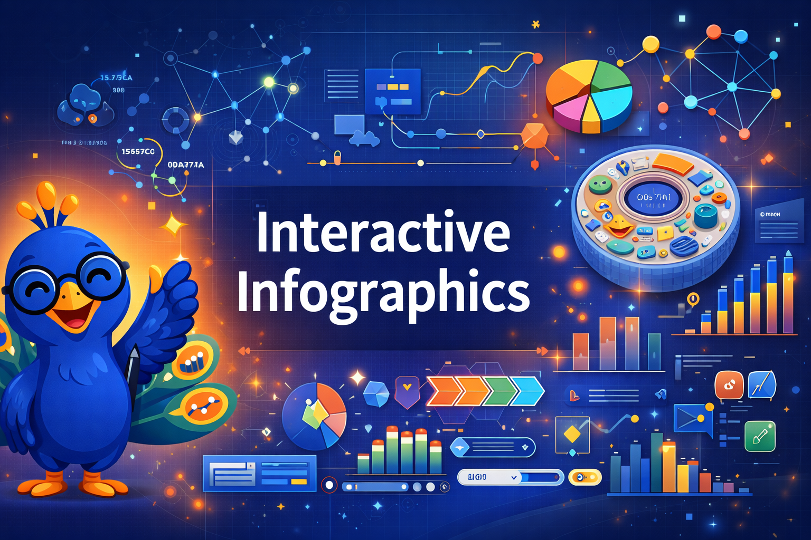

# Interactive Infographics with AI

Welcome to our website on using AI to generate interactive infographic MicroSims.

This github repository contains an full interactive textbooks for using AI to generate
a wide variety of interactive infographic MicroSims.
The goal is to allow non-programmers use AI and skills to generate
sophisticated interactive infographics with extensive hover and drill-down features
that are ideally suited for inclusion into intelligent textbooks.
These infographics have multiple modes for exploration, quizzes and
editing of regions and labels. xAPI protocols.

Infographics are now considered a subset of the overall [MicroSim Architecture](https://arxiv.org/abs/2511.19864).  We would love your feedback on if this book is still needed.

## Related Intelligent Textbooks and Papers

[MicroSims Site](https://dmccreary.github.io/microsims/) - this is our original interactive intelligent textbook on MicroSims.  The site has over 100 example "reference MicroSim" templates
that can show you the breath and depth of the MicroSim universe.  Many of these
MicroSims are also classified as interactive infographics.

[MicroSim Search and Similarity](https://dmccreary.github.io/search-microsims/)
Faceted Search over 800 MicroSims.  We have two tools that help you find related MicroSims.
One is a faceted search tool that uses the extensive metadata that is generated with each
MicroSim.  The other tools using embeddings to find similar MicroSims based on embedding 
distance measurements.  These tools help you answer the question, "What MicroSims are most similar
to this MicroSim"?

[Agent Skills Textbook](https://dmccreary.github.io/claude-skills/) - this is
an intelligent textbook that help you learn how to use and create your own
Agent skills for generating MicroSims from a short specification.  Note that
the skill in this book now work with OpenAI's codex command line interface
as well as other AI IDEs that now support skill standards.  See the [Agent Skill website](https://agentskills.io/home) for description of these standards.

[Agent Skills for generating MicroSims](https://dmccreary.github.io/claude-skills/skills/microsims/)
Working AI Skill files that are precise rules and complex decision trees used to generate textbooks with precise rules for
mapping a learning objective to a MicroSim type.

[Intelligent Textbooks](https://dmccreary.github.io/intelligent-textbooks/) - this is an intelligent textbook on how to generate intelligent textbooks.  It includes skills that generate chapter content where MicroSims and interactive infographic specifications are generated.  This is the ideal
way to test if your interactive infographic skill are effective for teaching concepts.

[Intelligent Textbook Case Studies](https://dmccreary.github.io/intelligent-textbooks/case-studies/) - this is a listing of 70 interactive intelligent textbook case studies.  Each of these textbooks has a MicroSims area and you can get an example of many of the MicroSims used in these textbooks.

[Automating Instructional Design](https://dmccreary.github.io/automating-instructional-design/) full of wonderful material about how to map a learning objective to a MicroSim type.  Includes many MicroSims that focus on learning theory such as understanding cognitive overload.

[Statistics Course](https://dmccreary.github.io/statistics-course/) - many microsims that discuss how data types determine visualizations.  This interactive intelligent textbook is much more data-intensive than most of the other interactive infographics we have created.  The course also has a detailed comparison of the use of charting libraries such as plotly and ChartJS as well as decision trees to help you select the right library for data visualization of statistical data.

[AP Biology](https://dmccreary.github.io/biology/) - this textbook contains many complex interactive infographics that push our interactive infographics skills to their limits.  It was during the creation of this textbook that we developed many of the overlay architectures with integrated label editing placement.