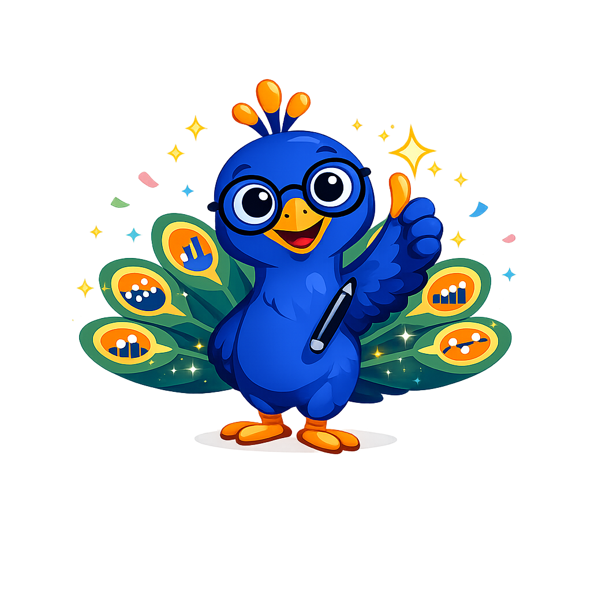

# Percy the Peacock - Mascot Test

This page shows all mascot images as well as the admonition styles for reference. Check that all the images have a transparent background
and do not have excessive padding around the drawing.
Note that the images have a dashed blue border around them so you can clearly see the padding.

## Image Tests

1. Welcome
{ width="150px"}
2. Thinking
{ width="150px"}
3. Tip
{ width="150px"}
4. Warning
{ width="150px"}
5. Encouraging
{ width="150px"}
6. Celebration
{ width="150px"}
7. Neutral
{ width="150px"}

## Admonition Tests

!!! mascot-welcome "Let's Make It Visual!"
    
    Welcome, visual thinkers! I'm Percy the Peacock, your guide through
    the world of interactive infographics. From simple labeled diagrams to
    complex polygon overlays — let's make it visual!

!!! mascot-thinking "Key Insight"
    
    Notice that every interactive infographic follows the same core pattern:
    a base image, an overlay configuration, and an event handler. Once you
    understand this architecture, you can build any type of infographic.

!!! mascot-tip "Percy's Tip"
    
    Always test your infographics at both 600px and 1400px widths to ensure
    they're truly responsive. The aliceblue drawing region should scale
    smoothly without breaking your layout.

!!! mascot-warning "Common Mistake"
    
    Don't forget to include Dublin Core metadata in your metadata.json file.
    Without it, your MicroSim won't be discoverable or properly indexed.
    Every infographic needs a title, creator, and description at minimum.

!!! mascot-encourage "You've Got This!"
    
    Causal loop diagrams can feel overwhelming at first — all those arrows
    and polarities! But once you learn to trace one loop at a time, the
    system dynamics become clear. Keep going, you're closer than you think!

!!! mascot-celebration "Excellent Work!"
    
    You've just built your first complete interactive infographic with
    overlay regions, hover-activated infoboxes, and xAPI event logging.
    That's a fully deployable MicroSim — display it with style!

!!! mascot-neutral "A Note from Percy"
    
    This course covers many JavaScript visualization libraries — p5.js,
    D3.js, Chart.js, and vis-network. You don't need to master them all.
    Focus on one that fits your project, and branch out from there.
