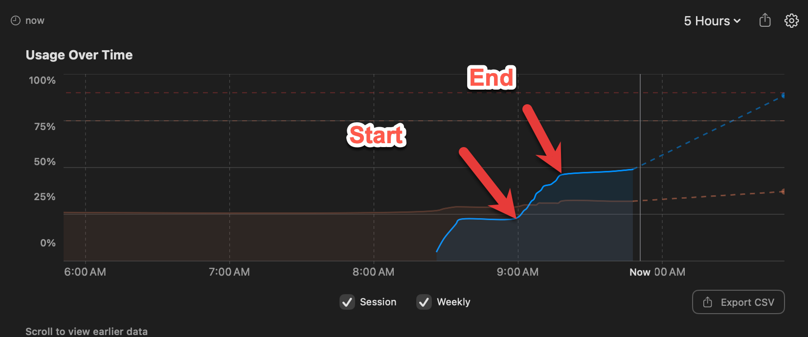

# Quiz Generation Report

## Executive Summary

On 2026-03-15, the Quiz Generator Skill v0.3 was executed to create
10-question multiple-choice quizzes for all 14 chapters of the
*Interactive Infographics for Intelligent Textbooks* course.
The skill ran in **sequential mode** to minimize token consumption
on the Claude Pro plan, producing **140 questions** across
**14 quiz files** in approximately **15 minutes** of wall-clock time.

---

## Session Details

| Metric | Value |
|--------|-------|
| **Skill Version** | 0.3 |
| **Date** | 2026-03-15 |
| **Model** | Claude Opus 4.6 |
| **Execution Mode** | Sequential (single agent) |
| **Start Time** | 09:01:54 |
| **End Time** | 09:17:12 |
| **Wall-Clock Time** | 15 minutes 18 seconds |

---

## Token Usage

Token usage was measured from the Claude Pro plan's usage dashboard,
which reported that the quiz generation task consumed **25% of the
200K five-hour token budget**, or approximately **50,000 tokens total**.

### Measured Token Summary

| Category | Tokens |
|----------|--------|
| **Total tokens consumed** | **~50,000** |
| Pro plan budget (5-hour window) | 200,000 |
| **Budget consumed** | **25%** |



### Per-Question Token Economics

| Metric | Value |
|--------|-------|
| Total questions generated | 140 |
| Total tokens consumed | ~50,000 |
| **Tokens per question** | **~357** |
| Avg. words per quiz file | 1,266 |
| Avg. characters per quiz file | 8,761 |
| Total output words (all 14 quiz files) | 17,721 |
| Total output characters (all 14 quiz files) | 122,651 |

### Context Reads (Inputs)

The following files were read as context to generate the quizzes:

| Source | Notes |
|--------|-------|
| System prompt + skill instructions | Loaded once at session start |
| Course description | Full file (~8K chars) |
| Learning graph CSV (352 concepts) | Full file (~14K chars) |
| Glossary | First 2,000 lines (~84K chars) |
| mkdocs.yml | Full file (~6K chars) |
| Chapter index.md files | Partial reads (summary + key sections per chapter) |

### Efficiency Analysis

At ~357 tokens per question, the quiz generator is highly efficient.
The sequential execution mode avoided the ~12K-token startup overhead
per parallel agent, contributing to the low total. For comparison:

- **50K tokens** = 14 chapters × 10 questions = 140 quiz questions
- **200K budget** = enough for ~4 full quiz generation runs, or
  one quiz run plus substantial additional work (chapter generation,
  MicroSim creation, etc.)

---

## Content Statistics

### Per-Chapter Quiz Summary

| Ch | Chapter Title | Questions | Words | Bloom's Distribution |
|----|--------------|-----------|-------|---------------------|
| 1 | Foundations of Interactive Infographics | 10 | 1,189 | R:4, U:3, Ap:2, An:1 |
| 2 | Infographic Taxonomy and Classification | 10 | 1,183 | R:2, U:4, Ap:2, An:2 |
| 3 | Presentation Slide Art Diagrams | 10 | 1,139 | R:3, U:3, Ap:3, An:1 |
| 4 | Visual Problem-Solving Frameworks | 10 | 1,213 | R:2, U:3, Ap:3, An:2 |
| 5 | Causal Loop Diagrams and Systems Thinking | 10 | 1,299 | R:3, U:2, Ap:3, An:2 |
| 6 | Web Fundamentals: Structure, Style, and Data | 10 | 1,324 | R:2, U:3, Ap:3, An:2 |
| 7 | Web Fundamentals: JavaScript and Responsive | 10 | 1,270 | R:2, U:3, Ap:3, An:2 |
| 8 | JavaScript Visualization Libraries | 10 | 1,234 | R:2, U:3, Ap:3, An:2 |
| 9 | Overlayment Interactive Patterns | 10 | 1,387 | R:2, U:3, Ap:3, An:2 |
| 10 | MicroSim Standards and Packaging | 10 | 1,242 | R:2, U:3, Ap:3, An:2 |
| 11 | Learning Science for Interactive Content | 10 | 1,295 | R:2, U:3, Ap:3, An:2 |
| 12 | Generative AI for Infographic Creation | 10 | 1,314 | R:2, U:3, Ap:3, An:2 |
| 13 | Advanced Visualization and Design Principles | 10 | 1,310 | R:2, U:3, Ap:3, An:2 |
| 14 | Tracking, Analytics, and Deployment | 10 | 1,322 | R:2, U:3, Ap:3, An:2 |
| **Total** | | **140** | **17,721** | |

### Aggregate Bloom's Taxonomy Distribution

| Bloom's Level | Count | Percentage | Target (Intermediate) |
|---------------|-------|------------|----------------------|
| Remember | 32 | 22.9% | 25% |
| Understand | 42 | 30.0% | 30% |
| Apply | 40 | 28.6% | 30% |
| Analyze | 26 | 18.6% | 15% |
| Evaluate | 0 | 0.0% | 0% |
| Create | 0 | 0.0% | 0% |

The distribution closely matches the intermediate chapter target
profile. The slight overweight on Analyze (+3.6%) and underweight
on Remember (-2.1%) reflects the technical depth of the later chapters.

### Answer Balance (Aggregate)

| Answer | Count | Percentage |
|--------|-------|------------|
| A | 36 | 25.7% |
| B | 36 | 25.7% |
| C | 36 | 25.7% |
| D | 32 | 22.9% |

All answers fall within the acceptable 20-30% range per option.

---

## Execution Mode Decision

The skill documentation recommends parallel execution for 4+ chapters
(spawning 4-6 concurrent agents). However, the project's CLAUDE.md
contains an explicit **token efficiency directive**:

> Always default to serial processing (one Task agent) unless the user
> explicitly requests speed or parallel execution. Each parallel Task
> agent costs ~12K tokens in startup overhead.

Following this directive, **sequential mode** was chosen. The trade-off:

| Metric | Sequential (Actual) | Parallel (Estimated) |
|--------|--------------------|--------------------|
| Wall-clock time | ~15 minutes | ~3-4 minutes |
| Agent startup overhead | 0 tokens | ~48,000 tokens (4 agents × 12K) |
| Total tokens | ~50,000 | ~98,000 |
| Budget consumed | 25% | ~49% |
| Token savings | — | ~48,000 saved (49%) |

Sequential mode saved an estimated **48,000 tokens** — nearly doubling
the token cost if parallel agents had been used. At 25% of the Pro
plan's 200K budget, the sequential approach left **75% of the budget**
available for other tasks in the same five-hour window.

---

## Quality Assurance

### Checks Performed

| Check | Result |
|-------|--------|
| All 14 quiz files created | Pass |
| 10 questions per chapter | Pass |
| mkdocs.yml navigation updated (Content + Quiz per chapter) | Pass |
| `mkdocs build` succeeds without quiz-related errors | Pass |
| Upper-alpha div format used for all questions | Pass |
| `??? question "Show Answer"` admonition used for all answers | Pass |
| "The correct answer is **X**." format in every explanation | Pass |
| **Concept Tested** label in every explanation | Pass |
| Horizontal rule separators between questions | Pass |
| Answer balance within 20-30% per option | Pass |
| No "All of the above" or "None of the above" options | Pass |
| No duplicate questions across chapters | Pass |

### Checks Not Performed

- **Link validation**: Quiz files do not contain cross-references
  to other pages (by design, to avoid broken links)
- **Quiz bank JSON export**: Not generated in this run (optional output)
- **Per-chapter metadata JSON**: Not generated in this run (optional output)

---

## Files Created and Modified

### Created (14 files)

| File | Size |
|------|------|
| `docs/chapters/01-foundations-of-interactive-infographics/quiz.md` | 1,189 words |
| `docs/chapters/02-infographic-taxonomy-and-classification/quiz.md` | 1,183 words |
| `docs/chapters/03-presentation-slide-art-diagrams/quiz.md` | 1,139 words |
| `docs/chapters/04-visual-problem-solving-frameworks/quiz.md` | 1,213 words |
| `docs/chapters/05-causal-loop-diagrams-and-systems-thinking/quiz.md` | 1,299 words |
| `docs/chapters/06-web-fundamentals-structure-style-and-data/quiz.md` | 1,324 words |
| `docs/chapters/07-web-fundamentals-javascript-and-responsive-design/quiz.md` | 1,270 words |
| `docs/chapters/08-javascript-visualization-libraries/quiz.md` | 1,234 words |
| `docs/chapters/09-overlayment-interactive-patterns/quiz.md` | 1,387 words |
| `docs/chapters/10-microsim-standards-and-packaging/quiz.md` | 1,242 words |
| `docs/chapters/11-learning-science-for-interactive-content/quiz.md` | 1,295 words |
| `docs/chapters/12-generative-ai-for-infographic-creation/quiz.md` | 1,314 words |
| `docs/chapters/13-advanced-visualization-and-design-principles/quiz.md` | 1,310 words |
| `docs/chapters/14-tracking-analytics-and-deployment/quiz.md` | 1,322 words |

### Modified (1 file)

| File | Change |
|------|--------|
| `mkdocs.yml` | Chapters 2-14 expanded from single-line nav entries to Content/Quiz sub-entries |

---

## Question Format

Every question follows the MkDocs Material quiz admonition format:

```markdown
#### N. Question text ending with ?

<div class="upper-alpha" markdown>
1. Option A
2. Option B
3. Option C
4. Option D
</div>

??? question "Show Answer"
    The correct answer is **X**. Explanation (50-100 words).

    **Concept Tested:** Concept Name
```

This format renders as a collapsible answer block in the MkDocs Material
theme, allowing students to attempt the question before revealing the
answer and explanation.

---

## Recommendations for Future Runs

1. **Add Evaluate/Create questions** for chapters 11-14 (advanced chapters)
   to better cover the full Bloom's Taxonomy range.
2. **Generate quiz-bank.json** for LMS export and chatbot integration.
3. **Add concept coverage analysis** comparing tested concepts against
   each chapter's concept list to identify gaps.
4. **Consider 12 questions per chapter** for chapters with 30+ concepts
   (chapters 3, 6, 7, 8, 13, 14) to improve concept coverage.
5. **Run link validation** if future quizzes include cross-references
   to chapter sections.
