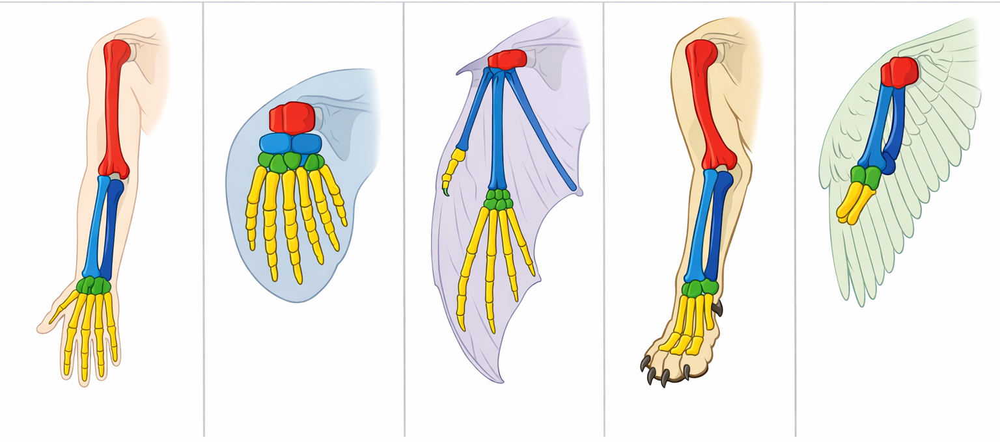

# Comparative Anatomy Explorer

<iframe src="main.html" height="616" width="100%" scrolling="no"></iframe>

[Run the Comparative Anatomy Explorer Fullscreen](./main.html){ .md-button .md-button--primary }

## About This MicroSim

This interactive explorer displays the forelimbs of five vertebrate species — human, whale, bat, dog, and bird — side by side with color-coded skeletal overlays. The same five bone groups (humerus, radius, ulna, carpals, phalanges) appear in each species, modified by natural selection for different functions. This is one of the strongest lines of evidence for common ancestry.

## How to Use

1. **Explore Mode**: Hover over any bone in any species to highlight the same bone across all five species simultaneously. An info box describes the bone's adaptation in that species.
2. **Toggle Bones**: Click "Hide Bones" to see just the silhouettes, then reveal bones again.
3. **Quiz Mode**: Click "Switch to Quiz Mode" to test your knowledge. You'll be presented with pairs of structures to classify as homologous, analogous, or vestigial. Immediate feedback explains the reasoning.

## Lesson Plan

### Grade Level
9-12 (AP Biology)

### Duration
10-15 minutes

### Prerequisites
Basic understanding of natural selection and common ancestry.

### Activities

1. **Exploration** (5 min): Students hover over each bone type across all five species. Ask: "What stays the same? What changes? Why?"
2. **Guided Practice** (5 min): Discuss the difference between homologous structures (same origin, different function) and analogous structures (different origin, same function). Use the bone legend to trace each bone across species.
3. **Assessment** (5 min): Switch to Quiz Mode. Students classify 8 structure pairs and review feedback.

### Assessment
- Students can correctly identify homologous, analogous, and vestigial structures.
- Students can explain why shared bone structure across species is evidence for common descent.
- Students score at least 6/8 on the classification quiz.

## References

1. [Homology (biology)](https://en.wikipedia.org/wiki/Homology_(biology)) — Wikipedia
2. [Comparative anatomy](https://en.wikipedia.org/wiki/Comparative_anatomy) — Wikipedia
3. [AP Biology Course and Exam Description](https://apcentral.collegeboard.org/courses/ap-biology) — College Board

## Forelimbs Image

<style>
      img {
      border: 1px dashed blue;
    }
</style>


To trim the top 5 pixels I ran the following UNIX shell command

```sh
 magick mogrify -gravity North -chop 0x5 docs/sims/comparative-anatomy/forelimbs.png
 ```