# List of Interactive Infographic MicroSims

Interactive Micro Simulations to help students learn interactive infographic design fundamentals.

-   **[Accessibility Audit Checklist](./accessibility-audit-checklist/index.md)**

    Assess the accessibility compliance of a sample MicroSim by evaluating it against a structured checklist covering alt text, semantic HTML, ARIA attributes, keyboard navigation, and more.

-   **[Advanced Interaction Pattern Showcase](./advanced-interaction-showcase/index.md)**

    Compare four advanced interaction patterns by experiencing each pattern applied to the same dataset about how a bill becomes a law.

-   **[AI Image Generation Prompt Builder](./ai-image-prompt-builder/index.md)**

    Construct effective text-to-image prompts by selecting components from structured categories and observing how each component affects the assembled prompt.

-   **[AI Flywheel](./ai-flywheel/index.md)**

    

    An infographic MicroSim of the AI Flywheel causal loop.

-   **[AI Quality Review Dashboard](./ai-quality-review-dashboard/index.md)**

    Assess the quality of an AI-generated MicroSim by reviewing its content, functionality, and pedagogical alignment using a structured review checklist.

-   **[AI-Assisted Workflow Evolution Timeline](./ai-workflow-evolution/index.md)**

    Examine the evolution of AI-assisted infographic creation from early template-based tools through current LLM-powered generation to projected future capabilities.

-   **[Animal Cell Explorer](./animal-cell/index.md)**

    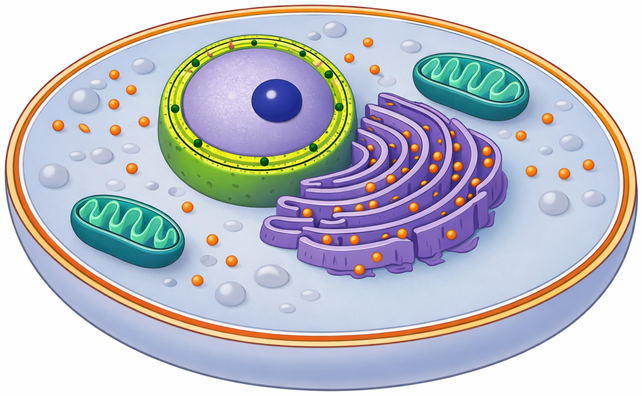

    Overlay-style MicroSim spotlighting six core organelles with hover callouts, AP tips, and a quiz mode for quick recall checks.

-   **[Audience Adaptation Comparison](./audience-adaptation-comparison/index.md)**

    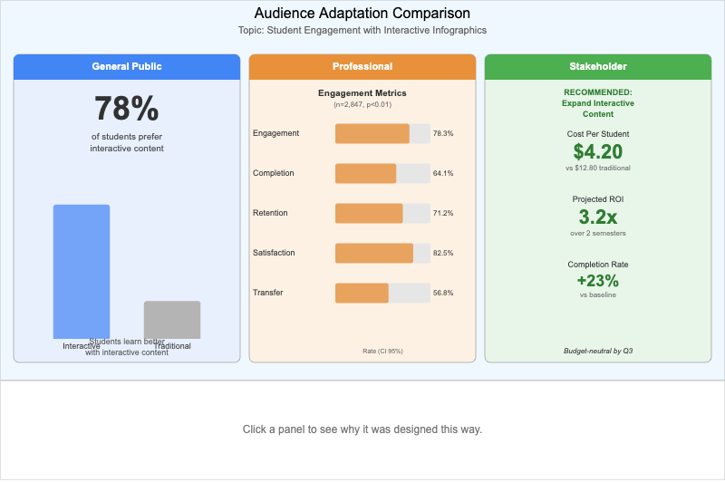

    Interactive comparison showing how the same student engagement data is presented differently for general public, professional, and stakeholder audiences.

-   **[Biogeochemical Cycles Dashboard](./biogeochemical-cycles/index.md)**

    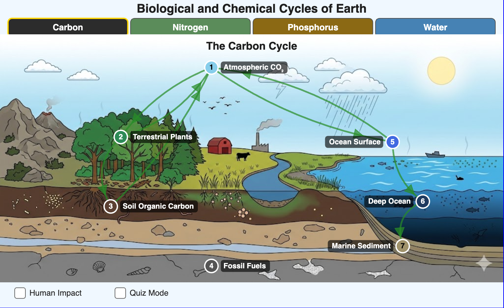

    Tabbed dashboard that overlays the carbon, nitrogen, phosphorus, and water cycles on one cross-sectional landscape.

-   **[Bloom's Taxonomy MicroSim Matcher](./blooms-microsim-matcher/index.md)**

    Differentiate between the six Bloom's Taxonomy levels by matching learning objectives to the correct level and selecting the most appropriate MicroSim interaction pattern.

-   **[Book Levels](./book-levels/index.md)**

    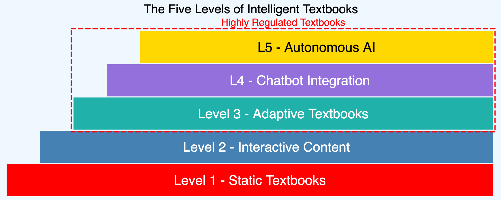

    Interactive tool showing the five levels of intelligent textbooks, from static PDF to fully adaptive AI-driven content.

-   **[Brewing Beer Process Explorer](./brewing-beer/index.md)**

    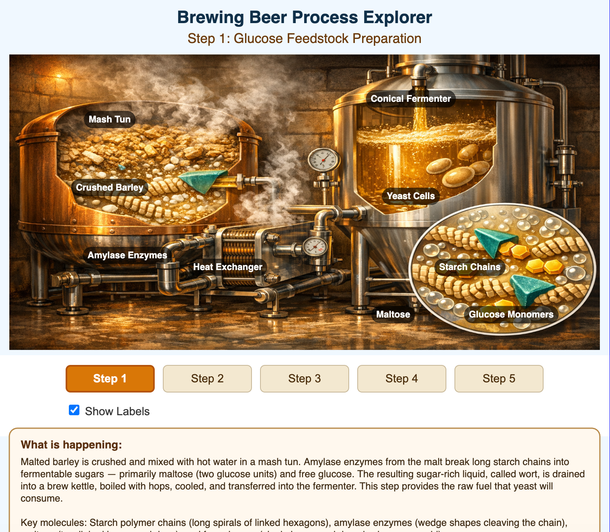

    Five-stage walkthrough of alcoholic fermentation that pairs brewery equipment cutaways with molecular-scale reactions.

-   **[Canvas vs SVG](./canvas-vs-svg/index.md)**

    Interactive MicroSim comparing Canvas (raster) and SVG (vector) rendering models across four stages — drawing, scaling, interaction, and performance.

-   **[Chart Type Gallery](./chart-type-gallery/index.md)**

    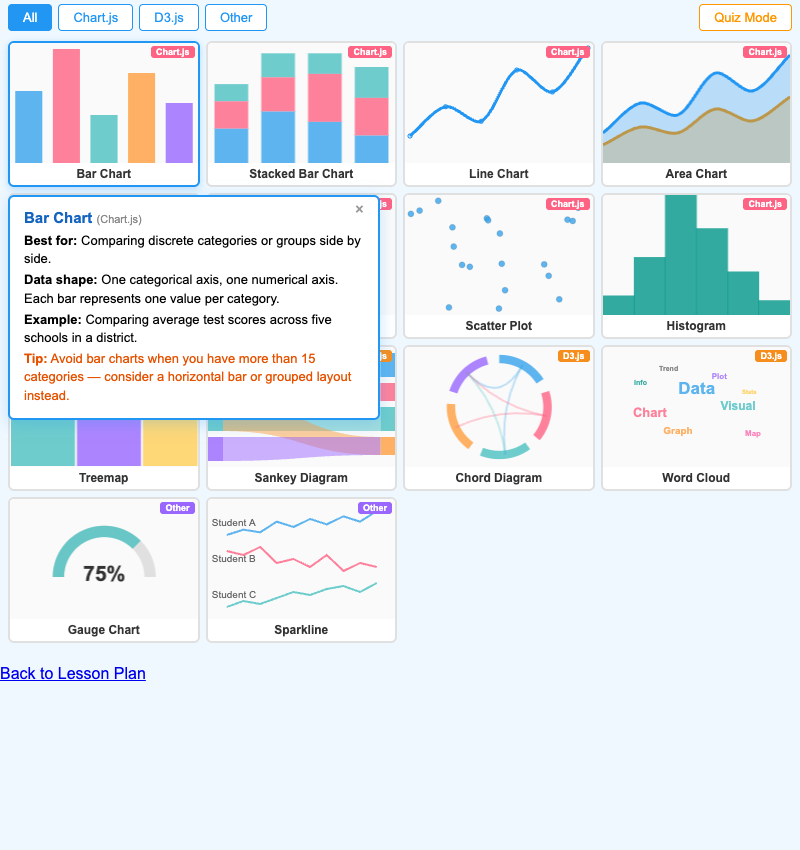

    Interactive gallery of 14 chart types with click-to-reveal details and quiz mode, helping learners identify which chart type best communicates different data characteristics.

-   **[Chart Type Selection Guide](./chart-type-selector/index.md)**

    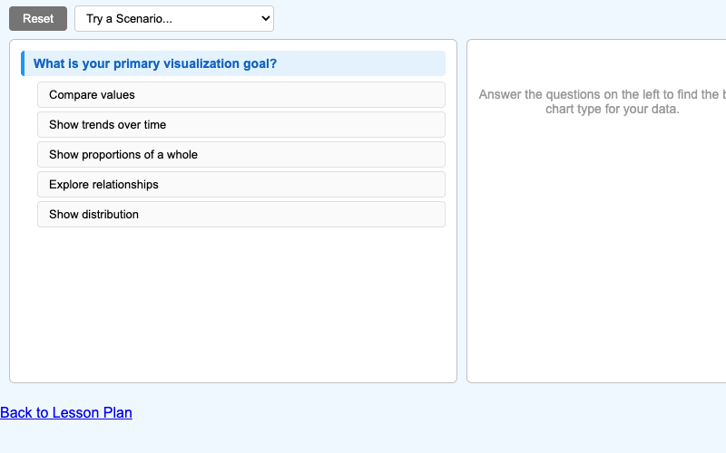

    Interactive decision tree that guides learners through questions about their data characteristics and visualization goals to recommend the best chart type.

-   **[CI/CD Deployment Pipeline](./cicd-deployment-pipeline/index.md)**

    Describe the continuous deployment pipeline for an intelligent textbook by tracing the flow from content change through Git commit, GitHub Actions build, and GitHub Pages deployment.

-   **[CLD Building Blocks Explorer](./cld-building-blocks/index.md)**

    Explain the three building blocks of a causal loop diagram (variables, causal links, polarity indicators) by interacting with each element and observing how they combine.

-   **[Cognitive Load Balance Explorer](./cognitive-load-explorer/index.md)**

    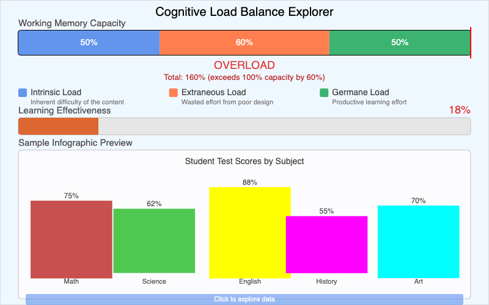

    Interactive visualization showing how three types of cognitive load (intrinsic, extraneous, germane) compete for limited working memory capacity.

-   **[Comparative Anatomy Explorer](./comparative-anatomy/index.md)**

    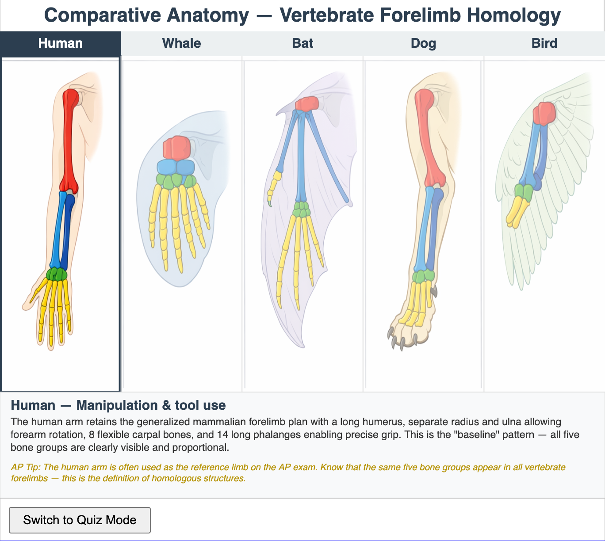

    Interactive MicroSim comparing vertebrate forelimb homology across five species, with bone highlighting and a classification quiz.

-   **[Concept-to-MicroSim Workflow](./concept-to-microsim-workflow/index.md)**

    Describe the five stages of the concept-to-MicroSim AI-assisted workflow and explain what happens at each stage.

-   **[Coordinate System Explorer](./coordinate-explorer/index.md)**

    Use pixel and relative coordinate systems to place elements on a canvas, converting between both systems in real time.

-   **[Design Patterns in Infographic Architecture](./design-patterns-infographic/index.md)**

    Interactive exploration of design patterns used in infographic architecture.

-   **[Design Principles Synthesis Dashboard](./design-principles-dashboard/index.md)**

    Interactive dashboard synthesizing key design principles for infographic creation.

-   **[Browser DevTools Navigator](./devtools-navigator/index.md)**

    Interactive guide to browser developer tools for inspecting and debugging MicroSims.

-   **[Diagram Type Decision Tool](./diagram-type-decision-tool/index.md)**

    Interactive tool for selecting the right diagram type based on your data and communication goals.

-   **[Educational Dashboard Builder](./dashboard-builder/index.md)**

    Design an educational dashboard layout by selecting chart types, arranging them in a grid, and configuring each chart's data source.

-   **[Engagement Metrics Dashboard](./engagement-metrics-dashboard/index.md)**

    Interactive Chart.js dashboard for visualizing engagement metrics across educational content.

-   **[Event Handling Data Flow](./event-handling-flow/index.md)**

    Interactive Mermaid diagram explaining how events are detected, mapped to interactive regions, and used to refresh the display.

-   **[Event Logging Flow Visualization](./event-logging-flow/index.md)**

    Interactive visualization of the event logging flow in MicroSim applications.

-   **[Framework Decision Pipeline](./framework-decision-pipeline/index.md)**

    Interactive pipeline for deciding which JavaScript framework to use for a given MicroSim.

-   **[Gestalt Principles Interactive Playground](./gestalt-principles-playground/index.md)**

    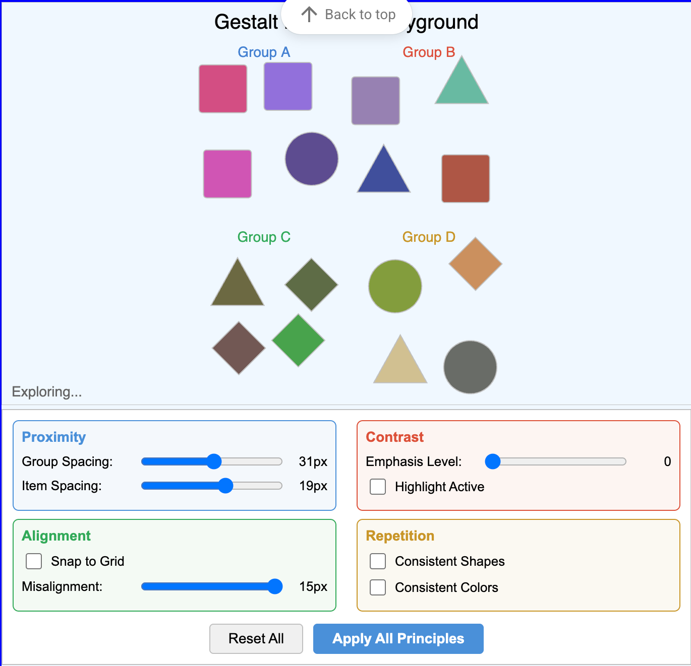

    Apply the four Gestalt principles (proximity, contrast, alignment, repetition) to visual elements by adjusting design parameters.

-   **[Hit Detection Playground](./hit-detection-playground/index.md)**

    Interactive playground for experimenting with hit detection techniques in canvas-based MicroSims.

-   **[Iframe Security Model](./iframe-security-model/index.md)**

    Interactive exploration of iframe security features including sandboxing, CSP, and cross-origin policies.

-   **[Infobox Positioning Comparison](./infobox-positioning-comparison/index.md)**

    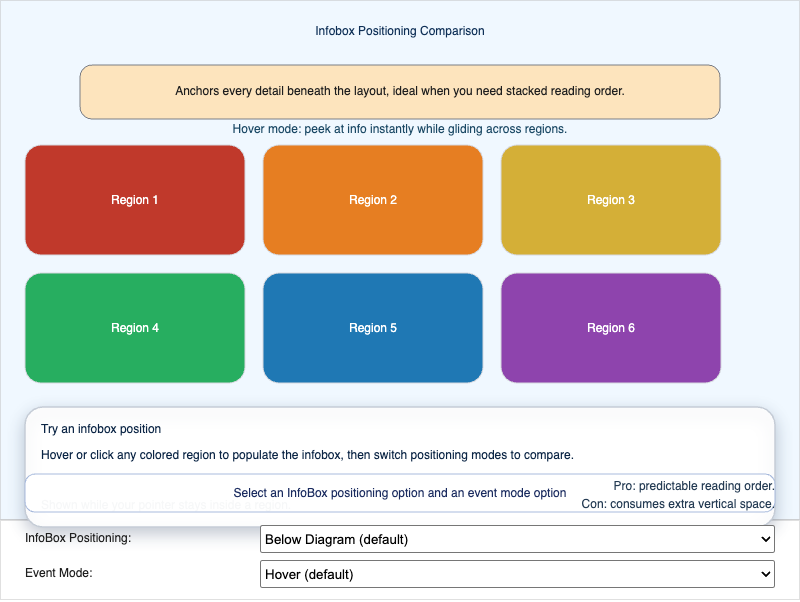

    Compare below, side panel, and floating tooltip infobox strategies with hover or click triggers.

-   **[Infographic Design Principles Workflow](./design-principles-workflow/index.md)**

    Interactive workflow showing how design principles are applied throughout the infographic creation process.

-   **[Infographic Development Workflow](./infographic-dev-workflow/index.md)**

    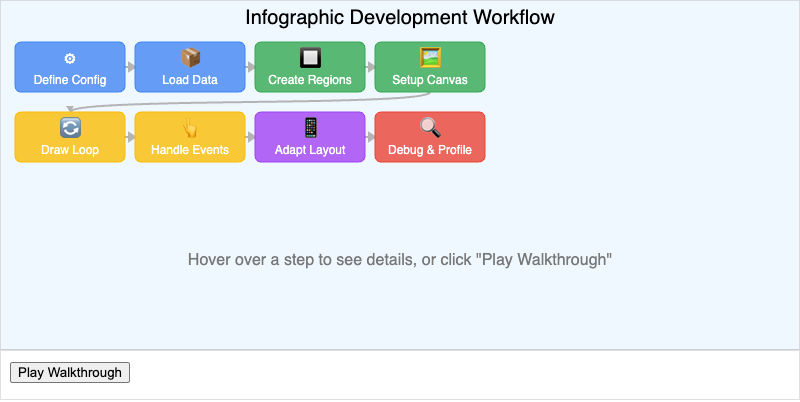

    Interactive visualization of the end-to-end infographic development workflow.

-   **[Infographic Lifecycle Wheel](./infographic-lifecycle-wheel/index.md)**

    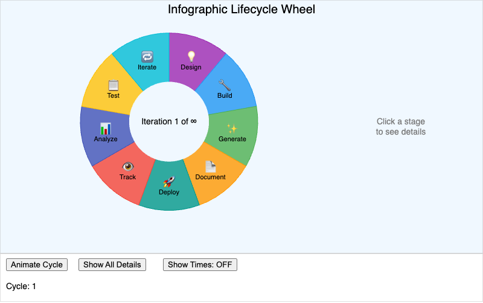

    Interactive wheel showing the phases of an infographic's lifecycle from concept to deployment and iteration.

-   **[Infographic Type Decision Tree](./infographic-type-decision-tree/index.md)**

    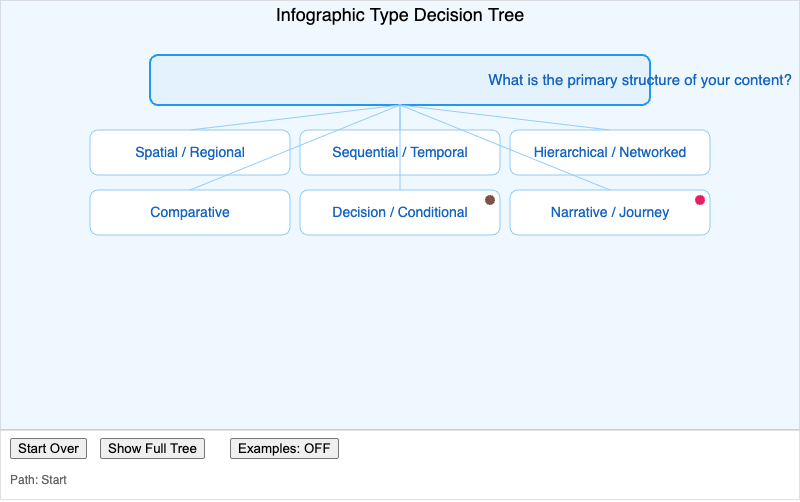

    Interactive decision tree for choosing the right infographic type based on content and audience.

-   **[Interaction Feedback Patterns Demo](./interaction-feedback-demo/index.md)**

    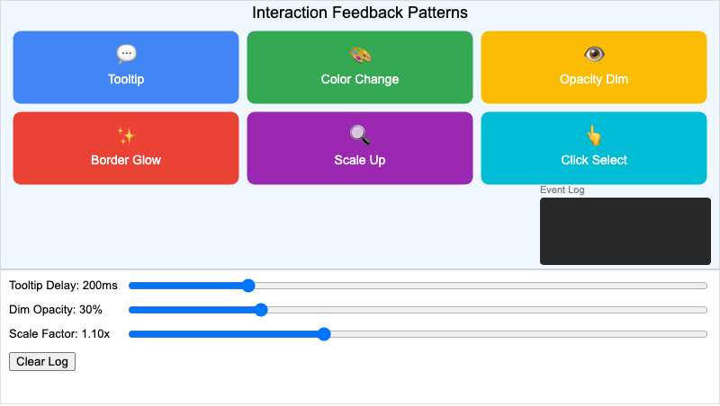

    Interactive demonstration of feedback patterns including hover effects, click responses, and drag interactions.

-   **[Interactive CLD Builder](./cld-builder/index.md)**

    Construct a causal loop diagram by placing variables, drawing causal links with polarity indicators, and identifying the resulting loop types.

-   **[Interactive Cycle Builder](./interactive-cycle-builder/index.md)**

    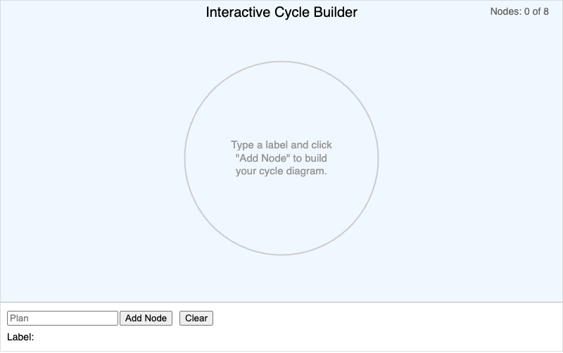

    Build and explore cyclical process diagrams by adding stages and defining relationships between them.

-   **[Interactive Infographic Taxonomy Tree](./infographic-taxonomy-tree/index.md)**

    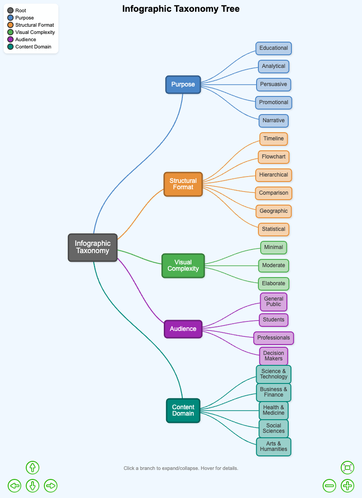

    Interactive hierarchical tree showing the five dimensions used to classify interactive infographics, with expandable branches and floating info panels.

-   **[Interactive Learning Graph Explorer](./learning-graph-explorer/index.md)**

    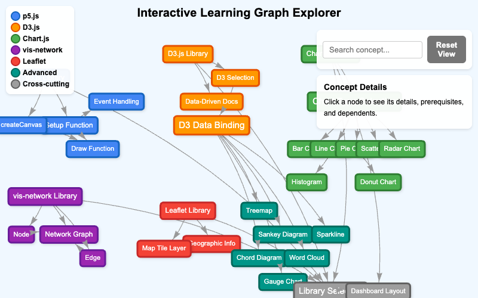

    Interactive vis-network explorer for navigating the course learning graph.

-   **[JavaScript Modern Syntax Playground](./js-syntax-playground/index.md)**

    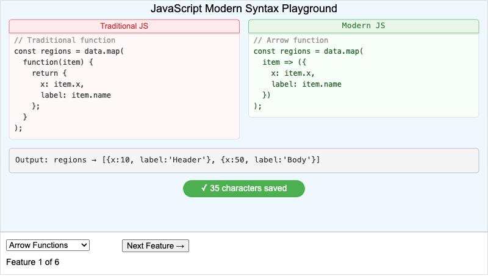

    Interactive playground for experimenting with modern JavaScript syntax including arrow functions, destructuring, and template literals.

-   **[Knowledge Graph Learning Path Explorer](./learning-path-explorer/index.md)**

    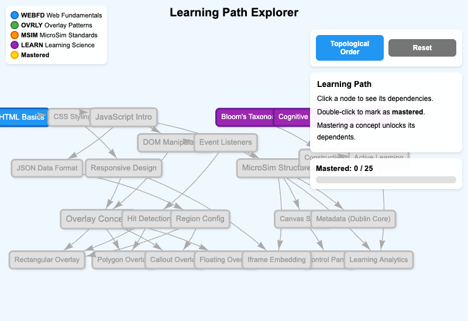

    Interactive vis-network explorer for discovering learning paths through the knowledge graph.

-   **[Learning Graph Viewer](./graph-viewer/index.md)**

    Interactive force-directed viewer for exploring the course learning graph with search, category filtering, pan/zoom, and live statistics.

-   **[Levels of Interactivity](./levels-of-interactivity/index.md)**

    Visual guide to the spectrum of interactivity in educational content, from static images through fully adaptive simulations.

-   **[Leverage Point and Unintended Consequence Explorer](./leverage-point-explorer/index.md)**

    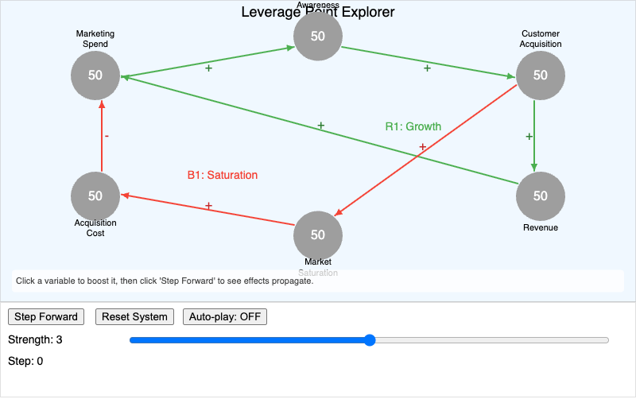

    Interactive exploration of system leverage points and their potential unintended consequences.

-   **[Library Selection Flowchart](./library-selection-flowchart/index.md)**

    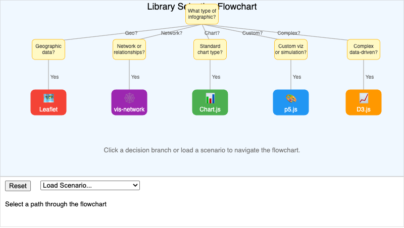

    Interactive flowchart for selecting the right JavaScript visualization library for a given MicroSim.

-   **[Mayer's Principles Interactive Comparison](./mayers-principles-comparison/index.md)**

    Apply Mayer's signaling, segmenting, and spatial contiguity principles by toggling each on and off in a sample infographic.

-   **[MicroSim Architecture Overview](./microsim-architecture-overview/index.md)**

    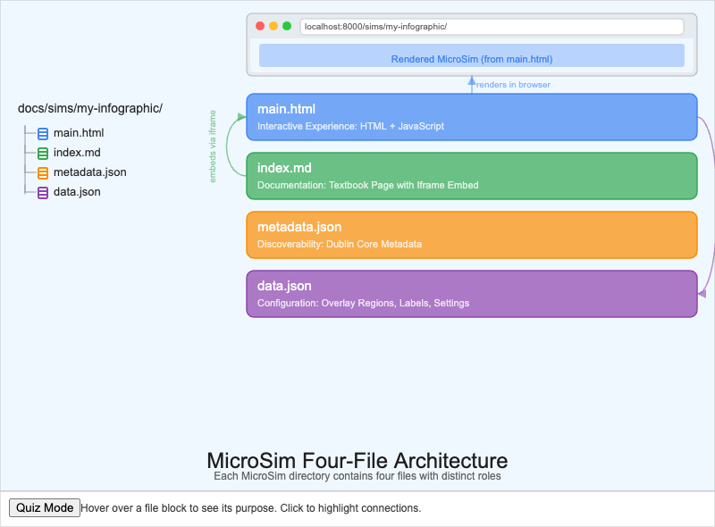

    Interactive diagram showing the four-file MicroSim directory structure and how each file serves a distinct role.

-   **[MicroSim Directory Structure Explorer](./microsim-directory-explorer/index.md)**

    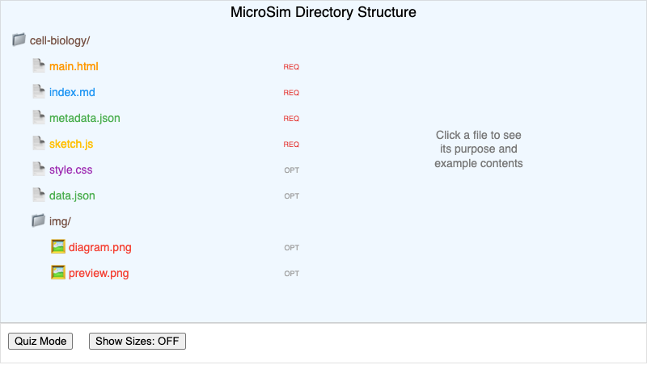

    Interactive explorer of the standard MicroSim directory structure and file organization.

-   **[MicroSim Quality Scorer](./microsim-quality-scorer/index.md)**

    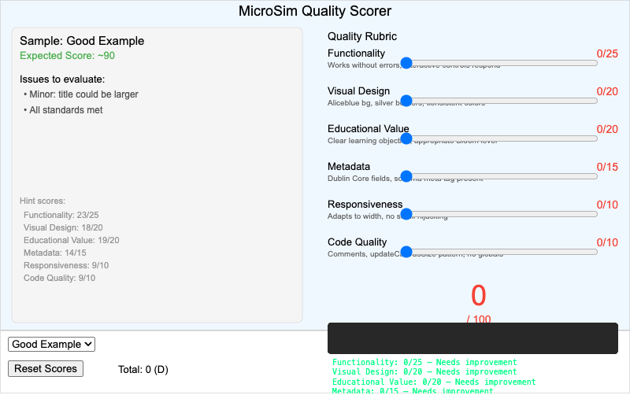

    Interactive quality scoring tool for evaluating MicroSims against standardized criteria.

-   **[MicroSim Uniqueness Interactive Venn Diagram](./microsim-uniqueness/index.md)**

    An interactive three-circle Venn diagram demonstrating what makes MicroSims unique at the intersection of Simplicity, Accessibility, and AI Generation.

-   **[MicroSim Visual Standards Explorer](./microsim-visual-standards/index.md)**

    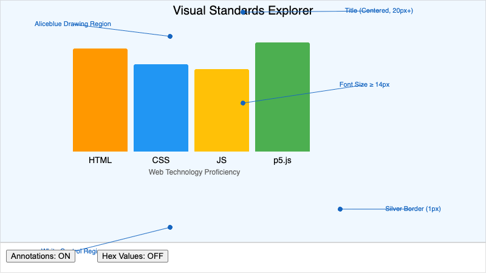

    Interactive explorer of visual design standards for consistent MicroSim presentation.

-   **[Multi-Dimensional Classification Explorer](./multi-dimensional-classifier/index.md)**

    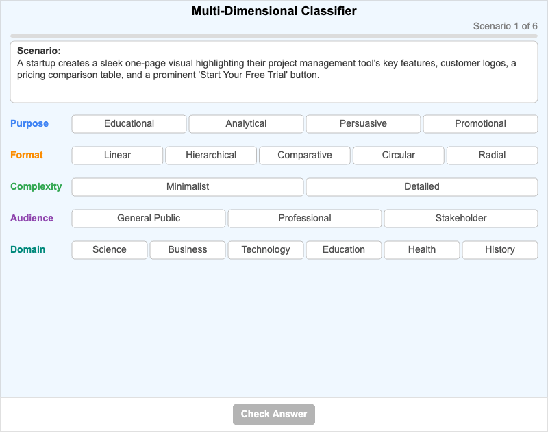

    Interactive quiz where learners apply the five-dimension interactive infographic taxonomy to classify real-world infographic descriptions.

-   **[Overlay Type Comparison](./overlay-type-comparison/index.md)**

    Assess which overlay type is most appropriate for a given image by viewing the same diagram rendered with all four overlay types side-by-side.

-   **[Process Diagram Variants](./process-diagram-variants/index.md)**

    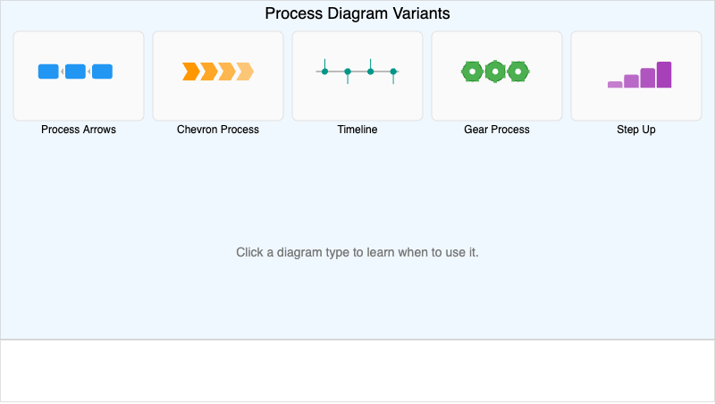

    Interactive comparison of different process diagram formats and their communication strengths.

-   **[Prokaryote vs. Eukaryote Cell Comparison](./prokaryote-eukaryote-comparison/index.md)**

    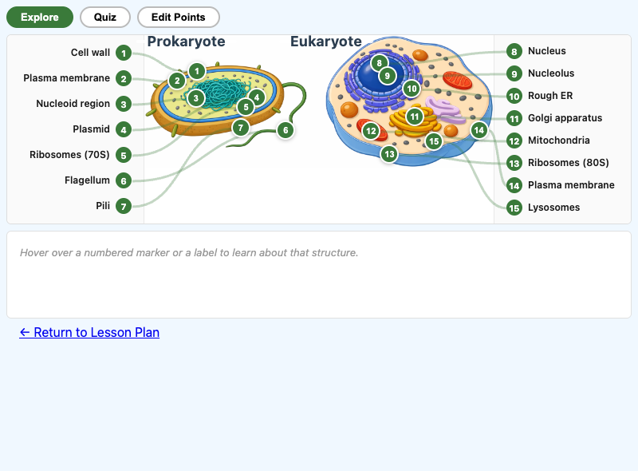

    Interactive diagram comparing prokaryotic and eukaryotic cell structures with labeled callouts, explore and quiz modes, and AP Biology exam tips.

-   **[Purpose Classification Sorter](./purpose-classification-sorter/index.md)**

    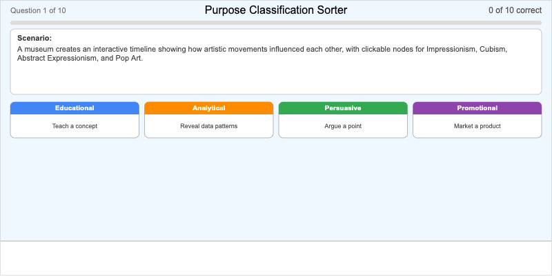

    Interactive classification quiz where learners sort infographic descriptions into four purpose categories with immediate feedback.

-   **[Radial Cycle: Continuous Improvement](./radial-cycle/index.md)**

    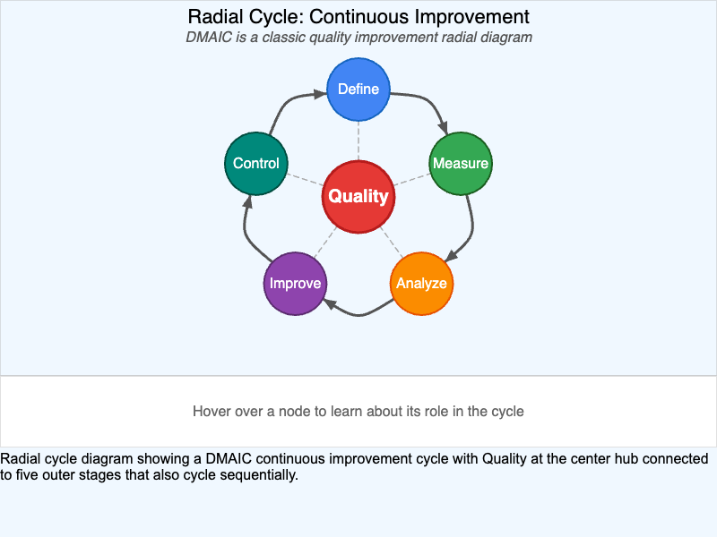

    Radial cycle diagram showing the DMAIC continuous improvement cycle with Quality as the central hub driving five sequential stages.

-   **[Reinforcing vs Balancing Loop Simulator](./reinforcing-vs-balancing/index.md)**

    Compare the dynamic behavior of reinforcing and balancing feedback loops by adjusting initial conditions and observing system behavior over time.

-   **[Relationship Diagram Explorer](./relationship-diagram-explorer/index.md)**

    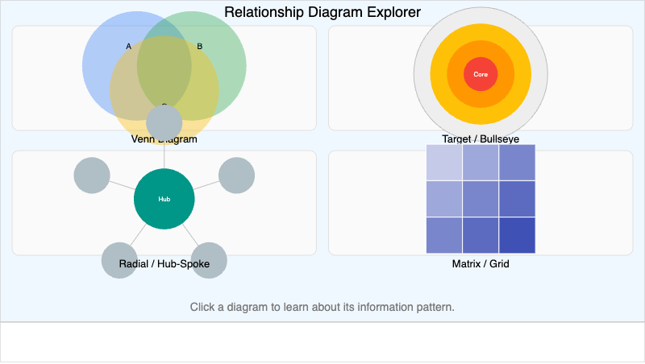

    Interactive explorer of different relationship diagram types and their visual representations.

-   **[Responsive Layout Simulator](./responsive-layout-sim/index.md)**

    Demonstrate how an infographic layout adapts to different viewport widths using breakpoints for mobile, tablet, and desktop.

-   **[School District Infographic Adoption CLD](./school-district-cld/index.md)**

    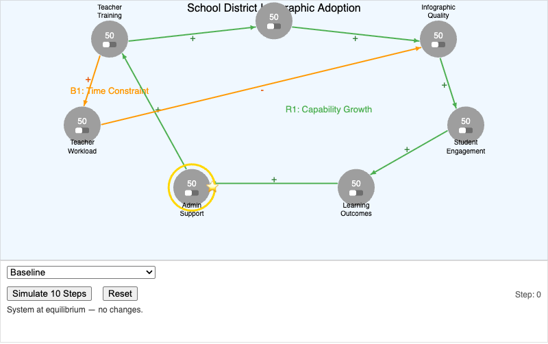

    Interactive causal loop diagram modeling the dynamics of infographic adoption in a school district.

-   **[Six Frameworks Interactive Gallery](./six-frameworks-gallery/index.md)**

    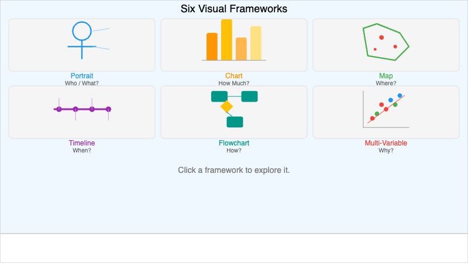

    Interactive gallery exploring six foundational frameworks for visual communication and infographic design.

-   **[Six W's Visual Matcher](./six-ws-visual-matcher/index.md)**

    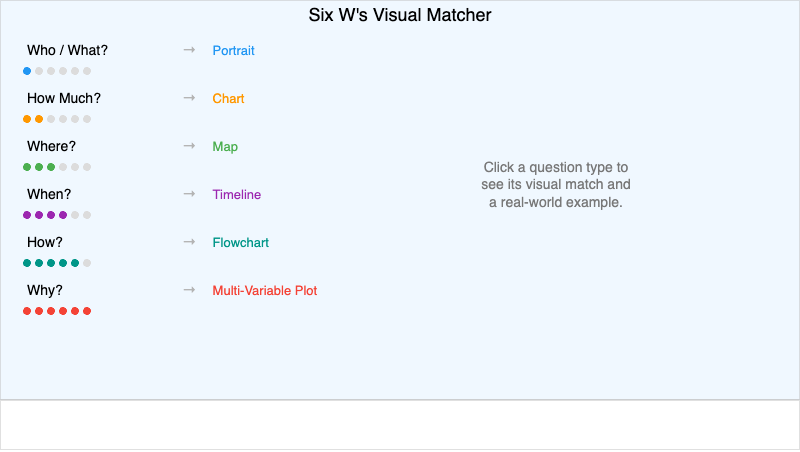

    Interactive matching exercise connecting the six W's of infographic planning to their visual representations.

-   **[SmartArt Category Gallery](./smartart-category-gallery/index.md)**

    Identify the eight SmartArt categories by their visual thumbnail and name, building recognition of the standard diagram vocabulary.

-   **[SmartArt Category Matching Quiz](./smartart-category-quiz/index.md)**

    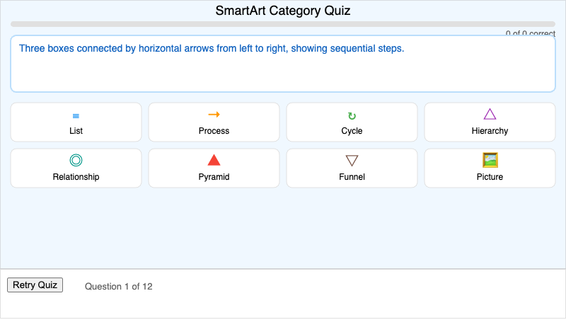

    Interactive quiz for matching SmartArt categories to their appropriate use cases.

-   **[SQVID Style Selector](./sqvid-style-selector/index.md)**

    Apply the SQVID framework by adjusting five style sliders and observing how the combination produces different visual styles.

-   **[Structural Format Gallery](./structural-format-gallery/index.md)**

    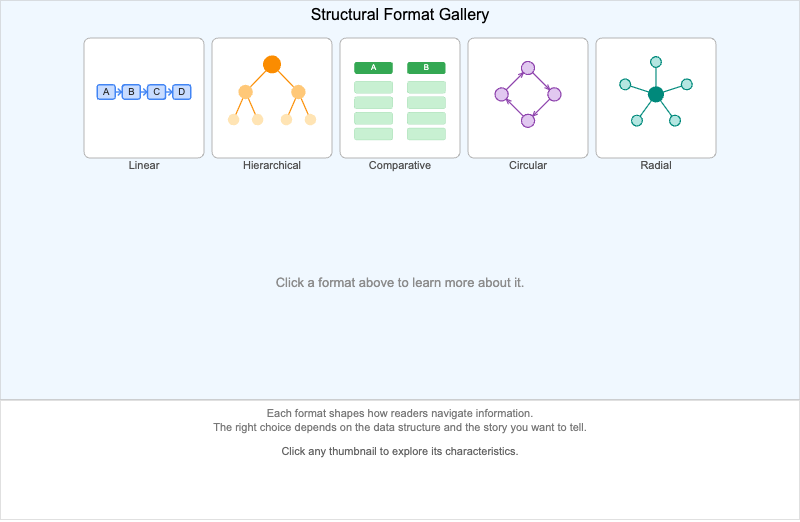

    Interactive gallery comparing five structural formats for interactive infographics — linear, hierarchical, comparative, circular, and radial.

-   **[Type 1 Rectangular Overlay Demo](./type1-rectangular-overlay/index.md)**

    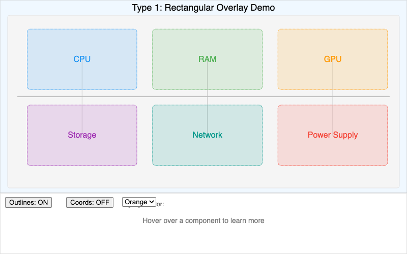

    Interactive demonstration of rectangular overlay regions with hover callouts and click interactions.

-   **[Type 2 Polygon Overlay Demo](./type2-polygon-overlay/index.md)**

    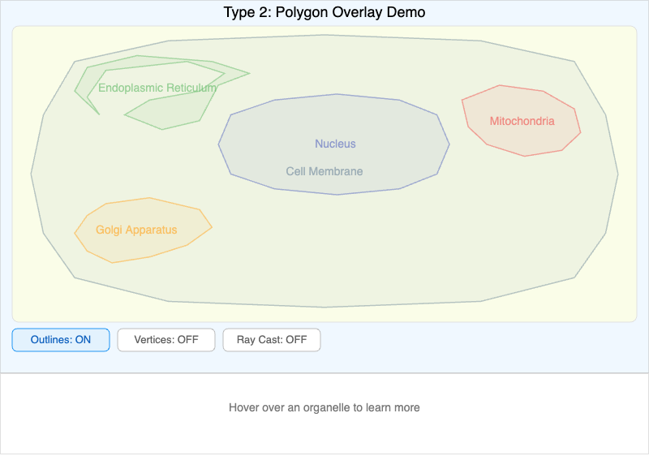

    Interactive demonstration of polygon-shaped overlay regions for complex image annotations.

-   **[Type 3 Callout to Edge Demo](./type3-callout-overlay/index.md)**

    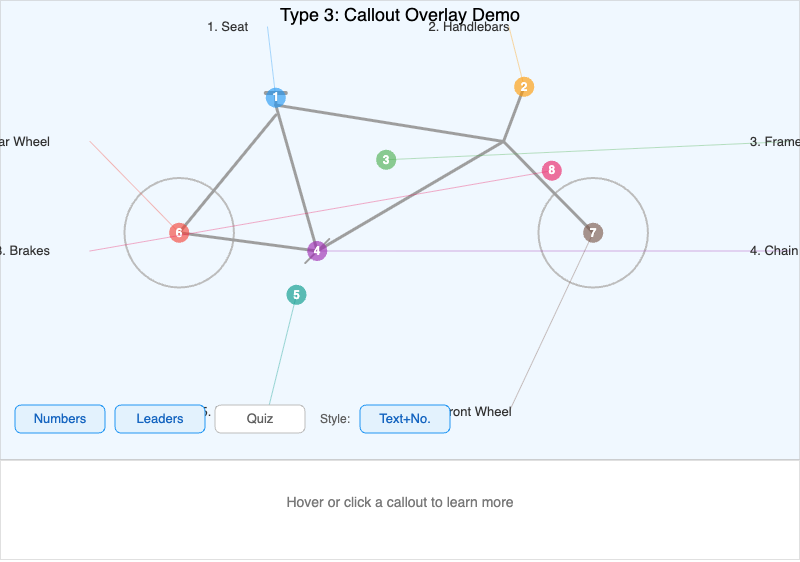

    Interactive demonstration of callout lines connecting labels to specific diagram features.

-   **[Type 4 Floating Label with Edit Mode Demo](./type4-floating-overlay/index.md)**

    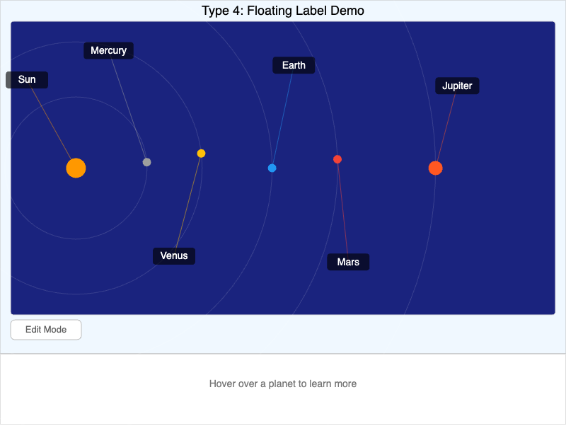

    Interactive demonstration of floating labels with an edit mode for repositioning annotations.

-   **[Virtuous and Vicious Cycle Examples](./virtuous-vicious-cycles/index.md)**

    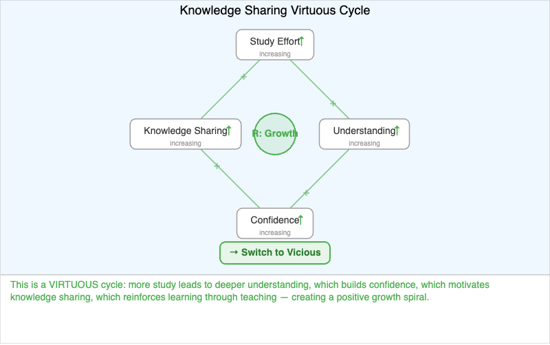

    Interactive examples of virtuous and vicious feedback cycles in real-world systems.

-   **[Visual Encoding Channel Explorer](./visual-encoding-explorer/index.md)**

    Compare the effectiveness of different visual encoding channels (position, length, color, size, shape, angle) by viewing the same dataset rendered through each channel.

-   **[Visual Framework Matching Quiz](./visual-framework-quiz/index.md)**

    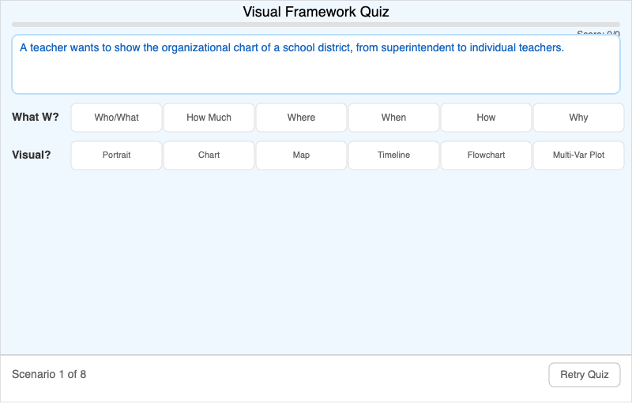

    Interactive quiz for matching visual frameworks to their definitions and use cases.

-   **[Web Fundamentals Architecture Overview](./web-fundamentals-architecture/index.md)**

    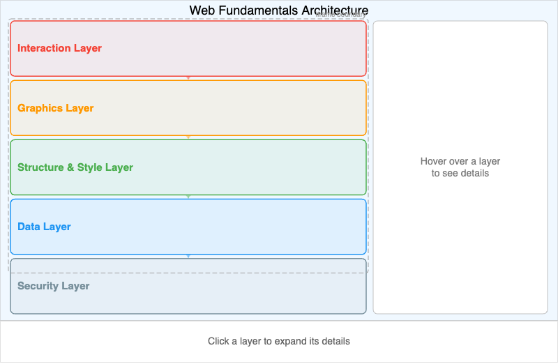

    Interactive overview of the HTML/CSS/JavaScript architecture that powers MicroSims in the browser.

