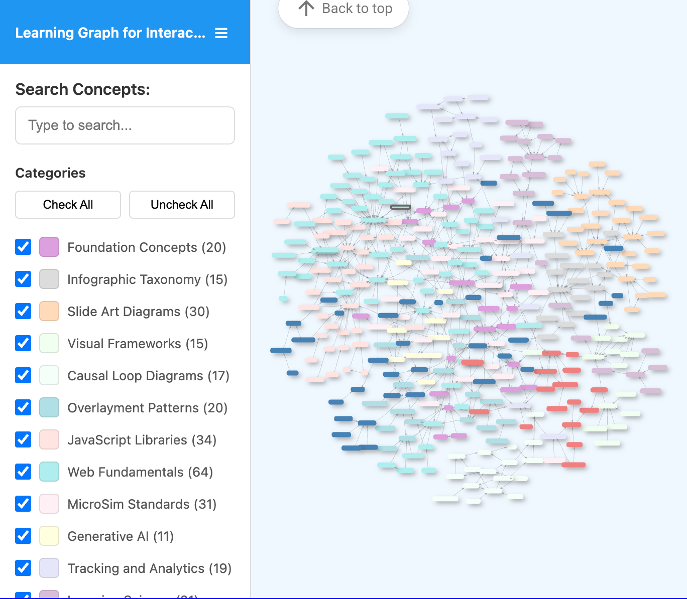

# List of Interactive Infographic MicroSims

-   **[Animal Cell](./animal-cell/index.md)**

    

    Overlay-style MicroSim that spotlights six core organelles with hover callouts,
    AP tips, and a quiz mode for quick recall checks. Use it as a template for
    single-diagram explorations.

-   **[Biogeochemical Cycles Dashboard](./biogeochemical-cycles/index.md)**

    

    Tabbed dashboard that overlays the carbon, nitrogen, phosphorus, and water
    cycles on one cross-sectional landscape. Toggle reservoirs, human impacts, and
    narrated overlays to trace atoms through shared ecosystems.

-   **[Brewing Beer Process Explorer](./brewing-beer/index.md)**

    

    Five-stage walkthrough of alcoholic fermentation that pairs brewery equipment
    cutaways with molecular-scale reactions. Students can jump between stages,
    reveal annotations, and read the biochemical story as glucose becomes ethanol.

-   **[Comparative Anatomy Explorer](./comparative-anatomy/index.md)**

    

    Forelimbs from five vertebrates appear side by side; hovering over a bone
    highlights the homologous structure in every species. Quiz mode asks learners
    to classify homologous, analogous, or vestigial pairs with instant feedback.

-   **[Prokaryote vs. Eukaryote Comparison](./prokaryote-eukaryote-comparison/index.md)**

    

    Dual-panel diagram contrasting bacterial and animal cells with 15 labeled
    structures, AP exam reminders, and a quiz pathway for structure identification.
    Edit mode lets authors fine-tune marker coordinates.

-   **[Learning Graph Viewer](./graph-viewer/index.md)**

    

    Interactive force-directed viewer that loads the book's learning graph so you
    can search, filter by category, pan/zoom the network, and view live statistics
    on visible nodes and edges.

