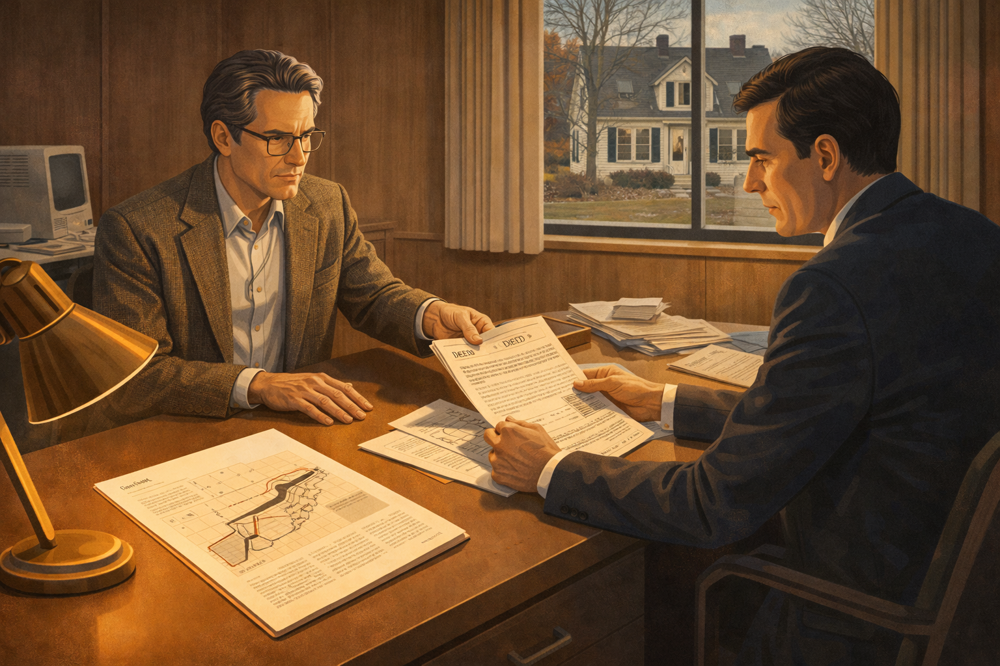
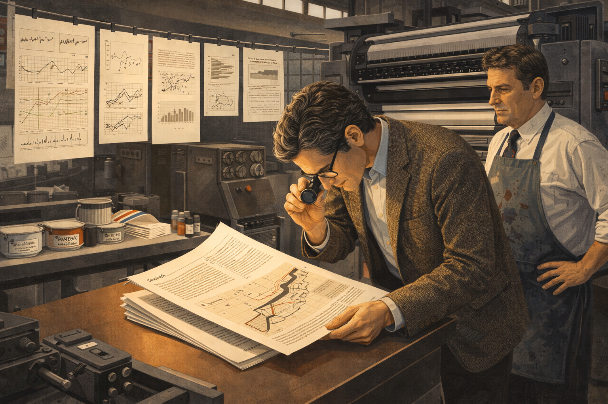
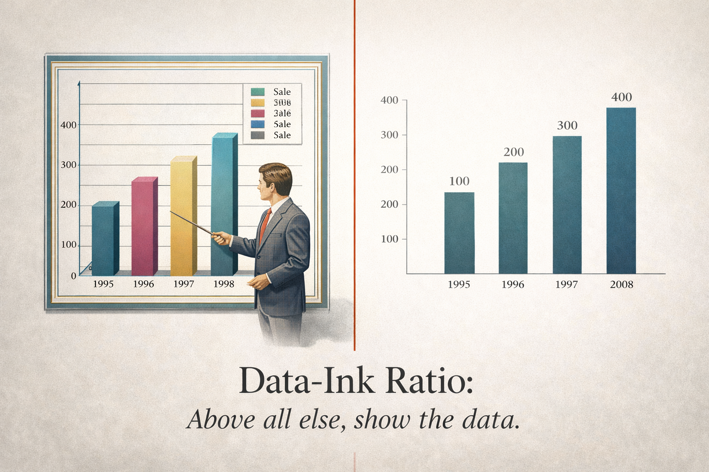
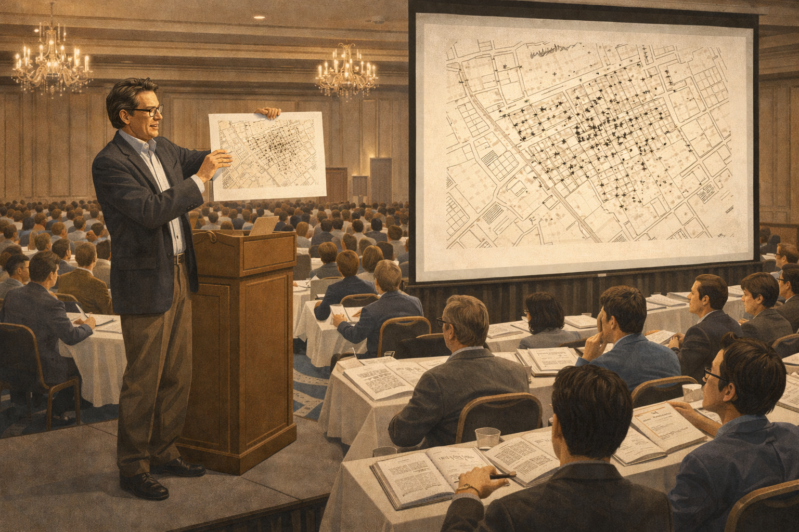

# The Ink That Matters: Edward Tufte's Crusade for Clarity

Cover Image Prompt

Please generate a wide-landscape 16:9 cover image for a graphic novel titled "The Ink That Matters: Edward Tufte's Crusade for Clarity." The scene shows a distinguished man in his early 40s with silver-streaked hair standing before an enormous open book that fills the background like a landscape. From the book's pages, minimalist data visualizations rise like architecture — clean line charts, sparklines, and small multiples float in the air around him. He holds a red pen in one hand, crossing out garish 3D pie charts and rainbow gradients that crumble away. The color palette transitions from cluttered, noisy graphics on the left (gaudy reds, yellows, greens) to elegant, restrained design on the right (warm grays, deep blues, crisp blacks on cream). The title "The Ink That Matters" appears in classic serif typography at the top. Art style: clean modernist illustration with mid-century design sensibility, inspired by Swiss International Style typography posters of the 1960s-1980s. Emotional tone: intellectual confidence and quiet revolution.

Narrative Prompt

This is the story of Edward Rolf Tufte (born 1942), an American statistician, professor emeritus at Yale University, and the most influential voice in modern information design. The narrative covers his life from his childhood curiosity about maps and charts, through his academic career in political science and statistics, to his transformative decision to self-publish "The Visual Display of Quantitative Information" in 1983 — mortgaging his home to do it because no publisher would produce the book to his exacting standards. The story traces how this single act of creative conviction launched a revolution in how the world thinks about presenting data.

The art style should be clean modernist illustration inspired by Swiss International Style design and mid-century graphic design, reflecting Tufte's own aesthetic values. Color palettes should be restrained and elegant — cream, warm gray, deep blue, black, with selective use of red for emphasis. Settings span from 1950s Kansas to 1960s-70s academic corridors at Princeton and Yale, to 1980s Connecticut where he self-published his masterwork, to modern conference halls where thousands attend his famous one-day courses.

The central theme is that clarity is not simplicity — it is the hard-won result of deeply understanding both your data and your audience. Tufte's story shows that the courage to insist on quality, even at great personal risk, can change an entire field.

### Prologue – Every Drop of Ink

In the age of flashy infographics and 3D spinning pie charts, one man stood firm with a radical idea: **most of the ink on most charts is wasted**. Edward Tufte didn't just criticize bad graphics — he showed the world what great ones look like, and in doing so, he changed how humanity communicates with data. His journey from a curious boy in Kansas to the most respected voice in information design is a story about vision, risk, and the relentless pursuit of clarity.

## Panel 1: A Boy and His Maps

Image Prompt

Please generate a 16:9 image in clean modernist illustration style depicting Panel 1. The scene shows a boy of about 10 years old lying on his stomach on a hardwood floor in a 1950s American living room in Kansas City. He is studying a large unfolded road map spread before him, tracing routes with his finger. Beside him are open issues of Scientific American magazine showing charts and diagrams. The room has mid-century furniture — a Danish modern chair, a floor lamp with a conical shade. Warm afternoon light streams through a window, casting long shadows. A bookshelf in the background is packed with encyclopedias. The color palette is warm honey tones, cream, and soft brown with touches of the map's blue highways and red state lines. The emotional tone is wonder and quiet absorption — a mind discovering that information can be beautiful.

Young Edward Tufte grew up in the 1950s surrounded by information. His father, a city official, brought home reports filled with tables and charts, and the boy was fascinated — not by the numbers themselves, but by how they were arranged on the page. He spent hours with road maps and Scientific American magazines, noticing that some layouts made ideas leap off the page while others buried them in confusion. Even then, he sensed that the way you show information changes what people understand.

## Panel 2: The Scholar's Path

Image Prompt

Image 2
Please generate a 16:9 image in clean modernist illustration style depicting Panel 2. The scene shows a young man in his early 20s, tall and thin with dark hair, walking across a sunlit Ivy League campus in the early 1960s. He carries a stack of books under one arm — statistics texts and political science journals. The architecture is collegiate Gothic with stone buildings and arched windows. Other students in early-1960s clothing walk in the background. A large oak tree frames one side of the composition. On a bulletin board near a doorway, a poorly designed bar chart poster is visible, with garish colors and unnecessary 3D effects. The young Tufte glances at it with a slight frown. Color palette: autumn golds, deep greens, warm stone gray, with the ugly poster in clashing reds and yellows as a contrast. Emotional tone: intellectual ambition mixed with a growing critical eye.

Tufte earned his undergraduate degree from Stanford and then a PhD from Yale, studying political science and statistics. He was trained to analyze data rigorously, but he noticed something troubling: the academic world was full of terrible charts. Presentations used garish colors, misleading scales, and decorative clutter that obscured the very data they were supposed to reveal. The young scholar began to ask a question that would define his life's work — *why does everyone accept bad graphics when good ones could change the way people think?*

## Panel 3: Teaching the World to See

Image Prompt

Image 3
Please generate a 16:9 image in clean modernist illustration style depicting Panel 3. The scene is a 1970s Yale University lecture hall. A professor in his early 30s (Tufte) stands at a chalkboard filled with hand-drawn statistical graphics — clean scatter plots, well-labeled axes, small multiples arranged in a grid. He gestures passionately to a seated audience of graduate students who lean forward with interest. The chalkboard drawings are precise and elegant, contrasting with a projected slide on a screen beside him showing a cluttered, poorly designed government report chart with unnecessary gridlines, excessive labeling, and a gratuitous 3D effect. The room has 1970s wood paneling, fluorescent lighting, and institutional carpet. Color palette: classroom browns and greens, chalk-white lines on dark green board, with the projected bad chart in muddy institutional colors. Emotional tone: passionate teaching and intellectual clarity cutting through mediocrity.

As a young professor at Yale, Tufte began teaching a course on statistical graphics that would become legendary. He didn't just teach students how to make charts — he taught them how to *see*. He showed them Minard's famous map of Napoleon's march to Moscow and asked, "How does one image convey six variables at once?" He showed them government reports drowning in chartjunk and asked, "What would happen if we removed everything that doesn't tell you something new?" His students began to realize that information design wasn't decoration — it was an act of respect for the audience.

## Panel 4: The Book No Publisher Would Touch

Image Prompt

Image 4
Please generate a 16:9 image in clean modernist illustration style depicting Panel 4. The scene shows a man in his early 40s sitting at a large drafting table in a home study, late at night, circa 1982. He is surrounded by manuscript pages, typographic specimens, and printed chart examples pinned to cork boards on the walls. A high-quality typography book lies open beside a magnifying loupe. He is carefully examining a proof sheet of a page layout showing a Minard-style data graphic reproduced at high resolution. An Anglepoise desk lamp illuminates the work area in warm golden light while the rest of the room is in shadow. Through a window, a Connecticut winter landscape is faintly visible. On the desk, rejection letters from publishers are stacked to one side, some crumpled. Color palette: warm lamplight gold, deep shadow blue-gray, cream paper, black ink. Emotional tone: solitary determination and meticulous care.

By the early 1980s, Tufte had compiled years of research into a manuscript that would become *The Visual Display of Quantitative Information*. But when he approached publishers, they balked. The book demanded exceptional production quality — high-resolution reproductions of historical graphics, precise typography, and careful color printing. Publishers wanted to cut costs: use cheaper paper, reduce the illustrations, simplify the layout. Tufte refused. If a book about visual excellence looked mediocre, it would undermine its own argument. The rejection letters piled up.

## Panel 5: The Bet on Himself

Image Prompt

Image 5
Please generate a 16:9 image in clean modernist illustration style depicting Panel 5. The scene shows a tense moment in a bank office in Connecticut, early 1983. Edward Tufte, in his early 40s with silver-streaked hair and wearing a tweed jacket, sits across a desk from a bank loan officer in a suit. Tufte is sliding house deed documents across the desk. The loan officer looks skeptical, reviewing the documents with raised eyebrows. Through the bank's window, a modest but charming New England home is visible — the house being mortgaged. On the desk between them sits a beautifully typeset manuscript page showing an elegant data visualization. The bank interior has early-1980s decor — wood paneling, a brass desk lamp, a computer terminal in the corner. Color palette: institutional browns and tans, with the manuscript page glowing cream-white as the brightest element in the frame. Emotional tone: high-stakes courage and quiet resolve in the face of doubt.

What Tufte did next stunned everyone who knew him. He took out a second mortgage on his home — borrowing roughly $180,000 — to self-publish the book himself. Friends and colleagues thought he was reckless. But Tufte understood something they didn't: the medium *was* the message. A book arguing for visual excellence had to *be* visually excellent. He hired the finest typographers, chose premium paper stock, and oversaw every detail of production personally. It was the biggest gamble of his life.

## Panel 6: Every Pixel, Every Point

Image Prompt

Panel 6
Please generate a 16:9 image in clean modernist illustration style depicting Panel 6. The scene shows a professional print shop in 1983. Edward Tufte stands beside a large offset printing press, examining a freshly printed signature (a folded section of pages) with a jeweler's loupe. A press operator in an ink-stained apron watches nearby. Sheets of beautifully printed pages hang on a drying line overhead, showing elegant statistical graphics — sparklines, scatter plots, and reproductions of historical charts. The printing press machinery is industrial and imposing. Ink cans and Pantone color guides sit on a nearby shelf. The printed pages are crisp cream with precise black ink and subtle color accents. Color palette: industrial grays and blacks of the machinery contrasting with the warm cream and precise lines of the printed pages. Emotional tone: craftsmanship and exacting standards meeting industrial production.

Tufte threw himself into the production process with obsessive precision. He visited the print shop repeatedly, checking color registration, paper grain, and ink density. He insisted that every reproduction of a historical graphic be printed at the highest possible resolution so readers could study the fine details. He selected typefaces with the care of a Renaissance printer. The result was not just a book about good design — it was a physical embodiment of good design. Every page practiced what Tufte preached.

## Panel 7: A Quiet Revolution Begins

Image Prompt

Please generate a 16:9 image in clean modernist illustration style depicting Panel 7. The scene shows a university bookstore in 1983, with copies of "The Visual Display of Quantitative Information" prominently displayed on a front table. The book has a clean, elegant cream cover with a reproduction of a time-series chart. A group of people — professors, graduate students, a graphic designer with a portfolio case — cluster around the display, picking up copies and flipping through pages with expressions of amazement and delight. One person holds a copy open to show a friend the Minard Napoleon chart reproduction. The bookstore has warm wooden shelves, soft overhead lighting, and an academic atmosphere. A hand-written sign reads "Just Published — Yale's Own Edward Tufte." Color palette: warm bookstore amber, cream of the book covers, rich browns of wooden shelves. Emotional tone: the excitement of discovery and word-of-mouth spreading.

When *The Visual Display of Quantitative Information* appeared in 1983, there was no advertising campaign, no publisher's marketing machine. The book spread by word of mouth — and it spread like fire. Statisticians, journalists, designers, engineers, and government analysts all recognized that someone had finally articulated what they'd always felt: most charts were badly made, and it didn't have to be that way. The book introduced concepts that would become part of the design vocabulary forever — **data-ink ratio**, **chartjunk**, **small multiples**, and **sparklines**.

## Panel 8: The Data-Ink Ratio

Image Prompt

Panel 8
Please generate a 16:9 image in clean modernist illustration style depicting Panel 8. The scene is a split composition showing the concept of "data-ink ratio." On the left half, a cluttered 1980s business chart: a 3D bar chart with gradient fills, unnecessary gridlines, a decorative border, drop shadows, a legend that repeats information already on the axes, and a clip-art businessman pointing at the bars. On the right half, the same data presented as a clean, minimal bar chart: thin black bars on white, direct labels, no gridlines, no border, no decoration — just data and ink that tells the truth. A thin red line divides the two halves. At the bottom, elegant serif text reads "Data-Ink Ratio: Above all else, show the data." Color palette: the left side uses garish 1980s business colors (teal, magenta, gold gradients); the right side uses restrained black, cream, and a single blue accent. Emotional tone: the satisfying clarity of removing everything unnecessary.

At the heart of Tufte's philosophy was a deceptively simple idea: **maximize the data-ink ratio**. Every drop of ink on a chart should present new information. If removing an element doesn't reduce the data being communicated, that element is chartjunk — visual clutter that makes the reader work harder for no benefit. This wasn't just an aesthetic preference. Tufte showed with rigorous examples that chartjunk actively misleads people, distorting perception and hiding patterns. Clarity wasn't about making things pretty — it was about making things *true*.

## Panel 9: The One-Day Course

Image Prompt

Please generate a 16:9 image in clean modernist illustration style depicting Panel 9. The scene shows Edward Tufte, now in his late 40s, standing on a stage in a large hotel ballroom before an audience of 300+ professionals, circa late 1980s. He holds up a large printed example — a beautiful reproduction of John Snow's 1854 cholera map of London. Behind him, a projection screen shows the same image enlarged. The audience members sit at tables with copies of Tufte's books open before them, along with printed course materials. Some audience members are sketching in notebooks. The ballroom has chandeliers and hotel conference decor. Tufte is animated, gesturing at the map with obvious passion. Color palette: conference-room neutrals (gray carpet, white tablecloths) with the warm cream of the books and the detailed map image as focal points. Emotional tone: intellectual evangelism and an audience being transformed.

Tufte didn't stop at books. He began offering one-day courses on information design — intense, six-hour seminars where he walked attendees through the principles of visual excellence. He brought original printings of historical graphics. He handed out copies of his books as course materials. The courses became legendary, attracting engineers from NASA, journalists from the New York Times, designers from Apple, and analysts from Wall Street. Over the decades, hundreds of thousands of people would attend. Tufte was building a movement, one converted mind at a time.

## Panel 10: When Bad Design Kills

Image Prompt

Please generate a 16:9 image in clean modernist illustration style depicting Panel 10. The scene shows a somber meeting room at NASA, circa 2003. On a large screen, the infamous PowerPoint slide from the Columbia disaster investigation is displayed — the slide with dense, confusing bullet points about foam debris impact analysis, with critical information buried in sub-sub-bullets. Edward Tufte stands to one side, pointing at the slide with a serious expression. Several NASA engineers in polo shirts and khakis sit around a conference table, some with troubled expressions. Papers and technical reports are spread on the table. Through a window, a NASA building exterior is faintly visible. Color palette: institutional grays and blues, harsh fluorescent lighting, the PowerPoint slide glowing in sterile white and blue on the screen. Emotional tone: grave seriousness — the realization that bad information design can have fatal consequences.

Tufte's most sobering contribution came after the Space Shuttle Columbia disaster in 2003. He analyzed the PowerPoint slides that NASA engineers had used to assess the danger of foam debris striking the shuttle's wing during launch. The critical finding — that the damage could be catastrophic — was buried deep in a hierarchy of bullet points, its urgency lost in the format's inherent fragmentation. Tufte argued powerfully that **the slide format itself contributed to the disaster** by making it impossible to see the data clearly. Information design, he showed the world, is not just about aesthetics. Sometimes it is a matter of life and death.

## Panel 11: The Four Books

Image Prompt

Please generate a 16:9 image in clean modernist illustration style depicting Panel 11. The scene shows a library or study filled with beautiful books. Edward Tufte, now in his 50s with distinguished silver hair, sits in a leather chair surrounded by three of his published masterworks arranged on a reading table: "The Visual Display of Quantitative Information," "Envisioning Information," and "Visual Explanations." Each book is open to a different iconic page — one showing sparklines, one showing a colorful map from Envisioning Information, one showing a scientific diagram. The room has floor-to-ceiling bookshelves, warm wood tones, and the quality of light you find in a fine rare-books room. A fourth manuscript in progress sits on a nearby desk. Color palette: rich library browns, deep greens, warm cream of premium book paper, with touches of color from the graphics reproduced in the open books. Emotional tone: the satisfaction of a life's work taking form across multiple volumes.

Over two decades, Tufte produced four landmark books that together form the canon of information design. *The Visual Display of Quantitative Information* (1983) established the principles. *Envisioning Information* (1990) explored how to represent complex, multivariate data on the flat surface of a page. *Visual Explanations* (1997) examined how images convey dynamics, mechanism, and causality. *Beautiful Evidence* (2006) synthesized his thinking about how evidence is presented and consumed. Each book was self-published to Tufte's exacting standards. Together, they sold over two million copies.

## Panel 12: Beyond the Page

Image Prompt

Please generate a 16:9 image in clean modernist illustration style depicting Panel 12. The scene shows a large outdoor sculpture installation on rolling green hills in Woodbury, Connecticut. Massive weathered steel sculptures — abstract geometric forms inspired by data patterns — rise from the landscape. Edward Tufte, now in his 60s, walks among the sculptures with a small group of visitors. The sculptures cast long afternoon shadows across the grass. In the background, a converted barn serves as a gallery space. Trees frame the scene. The sculptures have the quality of Richard Serra's work — monumental, austere, mathematically precise. One sculpture suggests the form of a three-dimensional graph. Color palette: oxidized steel oranges and browns, deep green grass, blue New England sky, warm afternoon golden light. Emotional tone: the expansion of a visual thinker beyond the page into physical space.

In later years, Tufte expanded his vision beyond two dimensions. He became a sculptor, creating large-scale works in weathered steel at his property in Woodbury, Connecticut, which he opened as a public art space. The sculptures embodied the same principles as his graphics — they were precise, information-rich, and stripped of unnecessary ornament. For Tufte, the work was a natural extension: whether on a page or in a field, the goal was the same — to present truth clearly and let the viewer's intelligence do the rest. He had spent his career trusting his audience, and now he trusted them in physical space.

## Panel 13: The Legacy in Every Screen

Image Prompt

Please generate a 16:9 image in clean modernist illustration style depicting Panel 13. The scene shows a modern office environment, circa 2020s. A diverse team of data analysts, UX designers, and developers sit around a large monitor displaying a clean, well-designed interactive dashboard — a Tufte-influenced design with sparklines, small multiples, and high data density but zero chartjunk. On the wall behind them hangs a framed poster of Tufte's famous quote "Above all else, show the data." One team member has a copy of "The Visual Display of Quantitative Information" on their desk. Another has a sticky note reading "Data-ink ratio!" on their monitor. The office has modern, minimal design — clean lines, good lighting, plants. Color palette: modern office whites and light grays, with the dashboard screen showing elegant blues and blacks on white, and the book's cream cover as a warm accent. Emotional tone: Tufte's legacy alive in everyday practice — his ideas have become the water in which designers swim.

Today, Edward Tufte's ideas are so deeply embedded in design practice that many people follow his principles without knowing his name. When a dashboard uses sparklines instead of gaudy gauges, that's Tufte. When a report uses small multiples to show change over time, that's Tufte. When a designer strips away gridlines, borders, and decorative fills to let the data breathe, that's Tufte. His influence flows through every well-designed data visualization on the web, in every newsroom graphic, and in every analytics tool that respects its users enough to show them the truth without distraction.

### Epilogue – What Made Edward Tufte Different?

Edward Tufte's story is not just about charts and graphs. It is about the courage to insist on excellence when the world is content with mediocrity, and the vision to see that how we present information shapes what people understand and believe.

| Challenge | How Tufte Responded | Lesson for Today |
|-----------|---------------------|------------------|
| Publishers refused his manuscript | Mortgaged his home to self-publish | When no one shares your vision, bet on yourself |
| Academic world accepted bad graphics | Created rigorous principles for visual excellence | Standards don't exist until someone insists on them |
| People saw charts as mere decoration | Showed that design affects comprehension and decisions | How you present data is as important as the data itself |
| PowerPoint culture buried critical information | Publicly demonstrated how format failures cost lives | Challenge tools and formats that limit clear thinking |
| Books alone couldn't reach everyone | Created one-day courses attended by hundreds of thousands | Find multiple channels to spread important ideas |
| Visual design was considered subjective | Grounded his principles in evidence and cognitive science | Back your design instincts with rigorous evidence |

### Call to Action

The next time you create a chart, a slide, or a dashboard, ask yourself: *Does every element on this page earn its ink?* Edward Tufte showed us that clarity is not a luxury — it is a responsibility. Every unnecessary gridline, every decorative gradient, every redundant label makes it harder for your audience to see the truth. You don't need a PhD or a printing press to honor Tufte's legacy. You just need the discipline to remove everything that doesn't help, and the respect for your audience to trust that they can handle the truth — clearly presented.

---

*"Above all else, show the data."*
— Edward Tufte

---

*"Clutter and confusion are not attributes of information, they are failures of design."*
— Edward Tufte

---

*"The world is complex, dynamic, multidimensional; the paper is static, flat. How are we to represent the rich visual world of experience and measurement on mere flatland?"*
— Edward Tufte

---

## References

1. [Edward Tufte - Wikipedia](https://en.wikipedia.org/wiki/Edward_Tufte) - Comprehensive overview of Tufte's life, career, publications, and influence on information design
2. [The Visual Display of Quantitative Information - Wikipedia](https://en.wikipedia.org/wiki/The_Visual_Display_of_Quantitative_Information) - Background on Tufte's landmark 1983 book and its impact on the field
3. [Chartjunk - Wikipedia](https://en.wikipedia.org/wiki/Chartjunk) - Explanation of one of Tufte's most influential concepts — the unnecessary visual elements that clutter data graphics
4. [Edward Tufte's Website](https://www.edwardtufte.com/) - Tufte's official site with information about his books, courses, and sculptural work
5. [Columbia Accident Investigation Board Report](https://en.wikipedia.org/wiki/Columbia_Accident_Investigation_Board) - Context for Tufte's analysis of how PowerPoint culture contributed to NASA decision-making failures
6. [Small Multiples - Wikipedia](https://en.wikipedia.org/wiki/Small_multiple) - Overview of the visualization technique championed by Tufte for showing change across a common framework
