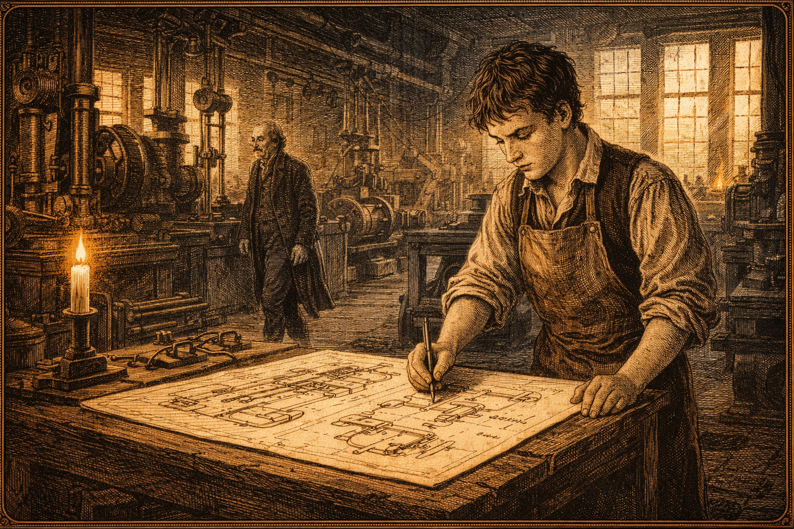

# The Shape of Numbers: William Playfair's Visual Revolution

Cover Image Prompt

Please generate a wide-landscape 16:9 cover image for a graphic novel titled "The Shape of Numbers: William Playfair's Visual Revolution." The central figure is a man in his late 20s wearing a late-18th-century Scottish gentleman's coat — dark wool with brass buttons — standing at a large drafting table covered with hand-drawn charts. In his right hand he holds a quill pen, and in his left a compass. Behind him, the charts on the table seem to come alive and rise into the air: a glowing line chart traces the arc of nations' wealth against time, a bar chart compares the commerce of great ports, and a pie chart slices the treasuries of empires. The room is a Georgian-era study — candlelight, dark wood paneling, stacks of leather-bound ledgers, an inkwell. Through a window behind him, Edinburgh's Old Town silhouette is visible against a twilight sky. The title "The Shape of Numbers" appears in elegant 18th-century serif typography at the top. The color palette transitions from warm amber candlelight at the center to deep midnight blue at the edges, with the charts glowing in gold, copper, and silver. Art style: detailed copper-plate engraving illustration with Georgian-era sensibility, rich cross-hatching textures, warm and dramatic. Emotional tone: the electricity of a world-changing idea being born in candlelit solitude.
Generate this image now.

Narrative Prompt

This is the story of William Playfair (1759–1823), a Scottish engineer, political economist, and secret agent who invented the three most widely used chart types in history: the line chart, the bar chart, and the pie chart. The narrative covers his life from his boyhood in rural Scotland under the tutelage of his brilliant elder brother John, through his apprenticeship at the workshop of James Watt, to his years in London and Paris where he developed his revolutionary idea that numerical data could be encoded visually — as shapes, areas, and lines — so that the eye could instantly grasp what the mind labored for hours to compute from tables of numbers.

The art style should be rich copper-plate engraving illustration, evoking the late 18th century Georgian and Enlightenment era. Color palettes should use warm amber, candlelight gold, sepia, aged parchment, and deep midnight blue. Settings include rural Perthshire, Scotland in the 1760s; Birmingham's Soho Manufactory in the 1770s; Georgian London in the 1780s; Revolutionary Paris in the 1790s; and the cramped London garret where Playfair spent his final years in 1820s poverty.

The central theme is the tragedy and triumph of being too far ahead of your time. Playfair invented something the academic world of the 1780s dismissed as a gimmick — "a mere picture," they said, "not proper science." He died in obscurity and debt in 1823. Yet the three chart types he invented are now rendered billions of times daily on every smartphone, dashboard, and data screen on Earth. His story teaches students that the most world-changing ideas are often the ones that seem obvious in retrospect but were radical — even ridiculous — when first proposed.
Generate this image now.

### Prologue – Before the Chart

Before William Playfair, there were no charts. There were tables — endless columns of numbers recording the wheat prices of nations, the import tonnage of ports, the debt of empires. Clerks spent careers copying them. Ministers spent days reading them. And almost no one truly understood what the numbers meant, because the human eye cannot see patterns hidden in rows of digits.

Then a restless Scottish engineer picked up a quill and asked a question no one had ever thought to ask: **What if we could see the numbers instead of reading them?**

## Panel 1 – The Brother Who Taught Him to See

Image Prompt

Please generate a 16:9 image in detailed copper-plate engraving illustration style depicting Panel 1. The scene shows a rural stone cottage in Perthshire, Scotland, circa 1768. Inside by firelight, a teenage boy of about 14 (John Playfair, serious, with sharp intelligent eyes) kneels beside a younger boy of about 9 (William Playfair, curious and wiry) on a stone floor. Between them is an open geometry textbook with diagrams of triangles and curves. John traces a geometric form with his finger and points toward the window, where the hillside outside seems to mirror the diagram's slope. A single tallow candle illuminates the scene from a rough wooden table. The walls are bare stone. Outside the small window, the rolling hills of Perthshire glow in fading evening light. Color palette: warm amber firelight, deep shadow browns, parchment white of the book pages, cool blue from the window. Emotional tone: tender mentorship between brothers — a brilliant mind kindling another.
Generate this image now.

When William Playfair was six years old, his father died. The family's small farm in Liff, Perthshire fell to his eldest brother John to manage — but John Playfair was no ordinary farmer. He was a mathematical genius who would later become one of Scotland's most celebrated professors of natural philosophy. In the long Scottish evenings, John taught young William geometry, drawing, and the idea that the world's patterns could be captured in lines and shapes. It was the most important education William would ever receive, and he didn't know it yet.

## Panel 2 – The Workshop of Watt

Image Prompt

Please generate a 16:9 image in detailed copper-plate engraving illustration style depicting Panel 2. The scene is the interior of the Boulton and Watt Soho Manufactory in Birmingham, England, circa 1774. The vast workshop is full of iron machinery, turning lathes, and the hiss of early steam. A teenage apprentice (William Playfair, about 15, in a leather apron) stands at a large drafting table beside the workshop's engineering drawings area. He is carefully inking mechanical blueprints — cross-sections of steam engine cylinders and valve mechanisms. In the background, James Watt himself — a lean man in his late 30s with wire-rimmed spectacles and a thoughtful expression — walks between machines, examining components. Shafts of light come through tall industrial windows. The room smells of hot iron and machine oil. Color palette: industrial iron grays and blacks, warm shaft-light golds from the windows, white vellum of the engineering drawings, the glow of forge fire in the deep background. Emotional tone: a young man learning precision and mechanical thinking from the greatest engineer of the age.
Generate this image now.

At age fourteen, William Playfair was apprenticed to the engineering firm of Boulton and Watt in Birmingham — the most technologically advanced workshop in the world. James Watt was perfecting his revolutionary steam engine there, and young Playfair spent four years as a draftsman, learning to translate complex mechanical ideas into precise visual drawings. He became extraordinarily skilled at encoding information in lines, angles, and proportions. What he didn't yet realize was that this skill — the skill of the engineer's drawing table — could be turned toward something far more radical than steam pistons.

## Panel 3 – London and the World in Numbers

Image Prompt

Please generate a 16:9 image in detailed copper-plate engraving illustration style depicting Panel 3. The scene is a Georgian London counting house in the early 1780s. A young man in his early 20s (William Playfair) sits at a high clerk's desk covered in ledger books, surrounded by columns of trade statistics — import figures, export tonnages, price tables. He holds his head in one hand, quill in the other, staring at a page of numbers with a frustrated expression. The ledger columns stretch to the horizon of the page — numbers and more numbers, with no end. Beside him, a crumpled piece of paper shows a frustrated attempt to understand a pattern in the figures. Through a window behind him, the Thames waterfront is visible — masts of merchant ships, the dome of St. Paul's in the distance. The office has tall Georgian windows, dark oak furniture, and stacks of ledgers floor to ceiling. Color palette: afternoon Thames light (silver-gray), dark oak browns, aged cream ledger pages with dense black figures, a single touch of deep red from the binding of one ledger. Emotional tone: the suffocating frustration of drowning in numbers that refuse to yield their meaning.
Generate this image now.

In London, Playfair worked in various commercial and engineering ventures, and everywhere he went he encountered the same problem: tables. Enormous, relentless tables of trade figures, price records, and national accounts. Britain was becoming the world's great commercial empire, generating more numerical data than any civilization in history — and no one could make sense of it. Government ministers published trade statistics in books of columns and figures. Economists wrote about them in text. But Playfair was haunted by a feeling that the patterns were there, hiding in the numbers, invisible to anyone who lacked the patience to read every row. *There had to be a better way.*

## Panel 4 – The Eureka Moment

Image Prompt

Please generate a 16:9 image in detailed copper-plate engraving illustration style depicting Panel 4. The scene is William Playfair's small London lodgings, late at night, circa 1785. He sits at his desk with a large sheet of drafting paper, a ruler, and several open ledger books of trade statistics. He has drawn a set of coordinate axes on the paper — a horizontal axis labeled with years from 1700 to 1780, a vertical axis labeled with trade value. He is now pressing his quill to the paper and drawing a continuous line that rises and falls with the import figures, year by year. As the line takes shape, his expression changes from concentration to revelation — he leans back slightly, mouth open, eyes wide. The candlelight makes the rising line on the paper seem to glow. A half-eaten meal sits forgotten to one side. Color palette: warm amber candlelight, deep shadow, the bright glow of white paper and fresh black ink, one small touch of red where the line peaks. Emotional tone: the electric shock of original insight — seeing something that has never been seen before.
Generate this image now.

One night, working by candlelight, Playfair did something no one had ever done before. Instead of recording England's trade figures as a column of numbers, he drew a horizontal axis representing time and a vertical axis representing value — and then he *drew a line* that rose and fell as the figures rose and fell across the years. He sat back and stared at what he had made. The entire century of England's commercial history was there, visible in a single sweeping curve. You could see at a glance when trade boomed and when it crashed. You could see the shape of a nation's economic life. In that moment, the line chart was born.

## Panel 5 – The Commercial and Political Atlas

Image Prompt

Please generate a 16:9 image in detailed copper-plate engraving illustration style depicting Panel 5. The scene is a London print shop in 1786. William Playfair, now 27, stands at the counter of an engraver's workshop watching as a copper printing plate is inked for the first time — the plate contains an engraved version of his line chart showing England's trade balance with its colonies. The copper plate, held by an engraver's assistant, reflects the workshop lamps in its polished surface. On a nearby table, the first printed proof sheets are laid out — the world's first published statistical line charts, showing rising and falling trade values rendered as flowing curves. The engraver, an older man with ink-stained hands, holds one proof sheet up to the light with a skeptical but impressed expression. Other artisans in the background continue their work among copperplate tools, ink pots, and drying racks. Color palette: the warm gleam of polished copper, deep workshop shadow, the crisp black-and-cream of the freshly printed proof sheets. Emotional tone: the tense excitement of watching a revolutionary idea take physical form for the first time.
Generate this image now.

In 1786, Playfair published *The Commercial and Political Atlas* — a book unlike anything ever printed. Instead of tables of statistics, it contained 44 charts, most of them time-series line charts showing England's trade with its colonies, European rivals, and the world. Each chart encoded years of data into a single, instantly comprehensible image. The book included what historians now recognize as the world's first published bar chart — comparing the imports and exports of Scottish trading ports in a single year. Playfair even color-coded the space between the import and export lines: favorable trade balances were shaded in one color, unfavorable in another. The concept of the chart legend was born.

## Panel 6 – The Bar Chart and the Skeptics

Image Prompt

Please generate a 16:9 image in detailed copper-plate engraving illustration style depicting Panel 6. The scene is a Georgian gentlemen's club or coffeehouse in London, 1786. Around a polished table sit four or five men in powdered wigs and frock coats — academics, economists, and government ministers. One man holds a copy of Playfair's Atlas open to the bar chart page and is pointing at it with a derisive expression, as if saying "this is not serious scholarship." Another man at the table nods in agreement — charts are "mere pictures," they say, not rigorous numbers. William Playfair stands to one side, still young, listening with restrained frustration and dignity. Behind him, a large window overlooks a Georgian street scene — carriages, merchants, the busy world of commerce that Playfair was trying to illuminate. The Atlas lies on the table, its pages open to one of his line charts. Color palette: the mahogany browns and dark greens of Georgian club decor, candlelight, the cream and black of the open book, Playfair's red coat as a warm accent. Emotional tone: the sting of having a brilliant idea dismissed by those with authority — a visionary facing the wall of convention.
Generate this image now.

The academic establishment received Playfair's charts with polite disdain. To scholars of the day, proper economic analysis meant tables of numbers, written arguments, and mathematical proofs. A chart was a diagram — suitable for engineering or navigation, perhaps, but not for serious intellectual work. Critics said his pictures "substituted images for thought." One reviewer wrote that while the charts might be useful for "those who have not the time to examine figures," they were no substitute for real analysis. Playfair pushed back in print, arguing fiercely that the eye grasps relationships that the mind takes hours to compute — but the establishment had decided. His charts were a novelty, not a revolution.

## Panel 7 – Paris in Flames

Image Prompt

Please generate a 16:9 image in detailed copper-plate engraving illustration style depicting Panel 7. The scene is Paris in 1789, during the early days of the French Revolution. William Playfair, now 30, stands at the edge of a Paris street crowded with revolutionary activity — a mob carrying torches, tricolor flags waving, pamphlets flying through the air. He is pressed against a stone building wall, watching with a journalist's keen attention, taking notes in a small pocket notebook. His expression combines alarm with sharp intellectual curiosity. In the background, firelight illuminates the Hôtel de Ville and smoke rises from a burning building. Citizens in various states of dress — some in fine bourgeois clothing, others in rough working clothes — surge through the street. Playfair's clothes mark him as a foreign gentleman trying not to draw attention. Color palette: dramatic contrast of torch-orange firelight and deep night shadows, the tricolor (blue, white, red) as bold accents, stone building grays, and the vivid human chaos of revolutionary street scenes. Emotional tone: a man witnessing history through a journalist's eyes — dangerous, exhilarating, and deeply instructive about power and inequality.
Generate this image now.

Playfair lived in Paris during some of the most dangerous years of the French Revolution, working as a journalist and political pamphleteer and — historians now believe — as an agent gathering intelligence for the British government. He witnessed the Terror firsthand, saw the guillotine at work, and understood viscerally how the vast inequality between France's wealthy elite and starving poor had produced catastrophe. The experience deepened his conviction that data — clearly displayed — could alert people to exactly these kinds of dangerous imbalances before they exploded. Back in England, he would write obsessively about income inequality, always returning to his charts as the most honest way to show what was happening.

## Panel 8 – The Statistical Breviary

Image Prompt

Please generate a 16:9 image in detailed copper-plate engraving illustration style depicting Panel 8. The scene is Playfair's London study, circa 1800. He sits at his drafting table working on a large circular diagram — the world's first pie chart. The circle is divided into colored segments representing the territories, revenues, and populations of the world's great empires: the British Empire, the Ottoman Empire, France, Russia, Prussia. Each segment is filled with careful hand-applied watercolor — crimson, gold, blue, green. A compass and protractor lie beside the work. On the wall behind him, earlier drafts of the circle diagram are pinned, showing his iterative design process — some attempts are crossed out, others annotated. The room is warm and cluttered with books, maps, and papers. A globe stands in one corner. Color palette: the vivid hand-applied watercolors of the pie segments (crimson, gold, cobalt, forest green, burnt sienna) against the cream paper, surrounding the warm amber tones of the study. Emotional tone: the focused joy of a craftsman-inventor perfecting a new visual language.
Generate this image now.

In 1801, Playfair published *The Statistical Breviary* — and with it introduced the third of his great inventions: the **pie chart**. Using circular diagrams with wedge-shaped sectors proportional to data values, he showed at a glance the relative sizes of the world's great empires — their territories, populations, and revenues — in a way that no table of numbers could match. He also experimented with circular area charts, where the area of each circle represented a country's total revenue. Playfair was encoding data into geometry, color, and spatial proportion — essentially inventing the entire visual vocabulary of modern data communication. He did not call his diagrams "pie charts." That name came later. He called them "proportion circles."

## Panel 9 – The Idea That Could Not Be Stopped

Image Prompt

Please generate a 16:9 image in detailed copper-plate engraving illustration style depicting Panel 9. The scene is a visual split composition showing Playfair's charts traveling through time and space. On the left, Playfair's original hand-drawn chart pages from the 1786 Atlas are shown — carefully engraved copper-plate prints with flowing line curves and hatched areas. In the center, the same data types appear in mid-19th-century scientific publications — Florence Nightingale's 1858 coxcomb chart and Charles Minard's 1869 flow map. On the right, the same chart types appear rendered on a modern computer screen — a glowing browser dashboard with interactive line charts, bar charts, and pie charts. The three eras are connected by a single continuous glowing timeline that runs horizontally through all three images. The whole composition is framed like an illuminated manuscript page with ornate Georgian border elements. Color palette: aged sepia and cream on the left, mid-toned Victorian color in the center, modern high-contrast digital blue-white on the right. Emotional tone: the awe of an idea crossing two hundred years without losing its power.
Generate this image now.

Despite being dismissed as "not serious scholarship," Playfair's chart types proved impossible to suppress. Other thinkers began using them — cautiously at first, then freely. Florence Nightingale used Playfair's polar area technique for her famous Coxcomb diagram in 1858. Economists, scientists, and engineers gradually adopted line and bar charts as natural tools for displaying data. Each new user extended Playfair's vocabulary. By the mid-19th century, the chart was no longer a novelty. It had become a standard way of communicating quantitative information — and nobody stopped to ask where it came from.

## Panel 10 – The Weight of Debt

Image Prompt

Please generate a 16:9 image in detailed copper-plate engraving illustration style depicting Panel 10. The scene shows William Playfair in his 50s, in a cramped and poorly lit London garret room, circa 1815. He sits hunched over a writing desk by a small smoky fire, working on a new pamphlet by dim candlelight. He looks tired — older than his years, with deep lines in his face and patched clothing. A stack of unpaid bills is visible under an inkwell. Through a grimy window, the rooftops of a poor London neighborhood are visible in gray winter light. On the desk beside the new manuscript lies a battered copy of his original 1786 Atlas, its cover worn from use. He rests his hand on it gently — a gesture of pride and sadness. A spider web in the corner of the window catches a thread of pale light. Color palette: cold gray winter light through grimy glass, dim amber of a nearly spent candle, faded browns and blacks of poverty, and one small warm note from the battered amber cover of the Atlas. Emotional tone: quiet dignity in hardship — a man who knows he changed the world but will not live to see the world know it.
Generate this image now.

Playfair was never good with money — or with the patience required to build a stable life. His years in Paris, his many business ventures, and his personality, which one contemporary described as "ingenious but combative," left him in perpetual financial difficulty. He spent his later years in London writing political pamphlets, translating books, and pursuing various schemes that never quite succeeded. The man who had invented the visual language of modern economics often could not pay his rent. He continued to write — furiously, prolifically — about data, inequality, and the importance of visual communication. But the academic world had moved on, and Playfair struggled to be heard.

## Panel 11 – The Last Charts

Image Prompt

Please generate a 16:9 image in detailed copper-plate engraving illustration style depicting Panel 11. The scene is a London print shop in 1821, two years before Playfair's death. An older Playfair, now in his early 60s with white hair and worn but dignified clothes, stands at a printer's counter examining proof sheets of a new edition of his work — an updated version of his trade charts. The printer, a young man, looks at the charts with genuine interest. The proof sheets show the original Playfair chart designs: flowing trade-balance lines, shaded areas of import and export, careful labels. The charts look just as fresh and radical as they did in 1786. On the counter beside the proofs, a new pamphlet by a young economist uses dense columns of figures — the old way — to make the same points that Playfair's charts make in an instant. Playfair glances at the pamphlet with an expression that mixes weariness and quiet vindication. Color palette: the neutral gray-cream of the print shop, fresh black ink of the proofs, and a warm amber shaft of afternoon light from the shop's open door. Emotional tone: late-career melancholy touched with the faintest pride — a man outlasting his moment but not yet knowing history will come for him.
Generate this image now.

In his final years, Playfair produced a third edition of his *Commercial and Political Atlas* and continued to argue for the importance of visual data in public discourse. He was writing and publishing to the end — in 1821, at age 62, he produced a new work on the price of wheat over two centuries rendered as a time-series chart. It was as clear and original as anything he had done forty years earlier. But London's intellectual world had no particular interest in an aging pamphleteer with old grievances and unfashionable ideas. William Playfair died on February 11, 1823, in poverty. No obituary in any major publication marked his passing.

## Panel 12 – The Silence After

Image Prompt

Please generate a 16:9 image in detailed copper-plate engraving illustration style depicting Panel 12. The scene is a split image divided horizontally. The top half shows a modest London churchyard in winter 1823 — a simple gravestone in gray snow, a lone figure (a gravedigger) walking away. The church is unremarkable, the day overcast. No mourners. The gravestone reads simply: "William Playfair, 1759–1823." The bottom half of the image shows the same scene sixty years later: the gravestone is now overgrown with moss, nearly illegible, forgotten in a corner of the churchyard. A young Victorian-era student walks past without noticing it, carrying under his arm a statistics textbook — open to a page covered with Playfair-style line charts and bar charts, the student's natural tools, as ordinary to him as paper itself. Color palette: cold winter gray-whites and stone blacks in the top half; soft Victorian amber and overgrown greens in the bottom half, with the student's textbook page glowing warm cream. Emotional tone: the profound irony of history — the inventor of the world's most used graphical tools buried in obscurity as those very tools are used on the very next page.
Generate this image now.

William Playfair was buried without fanfare in London in 1823. For decades, his contribution to the world was almost entirely forgotten. Statisticians used charts without knowing who had invented them. Economists reproduced line charts and bar charts as if they had always existed. Playfair's name appeared in footnotes, if at all. The greatest irony was that by the time of his death, the visual tools he had invented were already spreading through the scientific and commercial world — being used by exactly the kinds of people who had dismissed him. He had been too early, by exactly one generation.

## Panel 13 – The Billions of Charts

Image Prompt

Please generate a 16:9 image in detailed copper-plate engraving illustration style depicting Panel 13, but with a striking visual contrast: the engraving style of the borders and framing gives way in the center to a modern data world. The central panel shows a vast montage of screens — smartphones, tablets, laptops, televisions, hospital monitors, financial trading floors, weather dashboards, school classroom projectors — every one of them displaying charts. Line charts, bar charts, pie charts. Every screen is alive with Playfair's three inventions in their modern digital form. In the foreground, a faint ghost image of Playfair in Georgian dress stands with his back to the viewer, facing this wall of screens, as if seeing for the first time what his late-night candlelit sketches became. The engraving borders of the outer frame have Playfair's original 1786 chart motifs worked into them as decorative elements. Color palette: the warm copper-amber of the outer engraving frame gives way to the cool blue-white glow of modern screens in the center, with Playfair's ghost figure silhouetted between the two worlds. Emotional tone: overwhelming, humbling wonder — two centuries of revolution compressed into a single image.
Generate this image now.

Today, more than two billion charts are generated every day — in business reports, scientific papers, news articles, social media posts, medical dashboards, and educational materials. Every time a financial analyst plots stock prices over time, every time a public health dashboard shows a pandemic curve, every time a student's grade report displays a bar chart — William Playfair's invention is at work. His three chart types are now so universal that most people cannot imagine a world without them. They have become, in the truest sense, part of human language. They came from a Scottish engineer's candlelit desk in 1785, and from the simple, radical question: *what if we could see the numbers?*

### Epilogue – What Made William Playfair Different?

William Playfair did not discover a scientific law or build a machine. He invented something more subtle: a *way of seeing*. His gift to the world was the recognition that numbers, which the human mind struggles to grasp in tables and columns, become instantly comprehensible when encoded as shapes, positions, and areas in visual space.

| Challenge | How Playfair Responded | Lesson for Today |
|-----------|------------------------|------------------|
| Data buried in tables no one could interpret | Invented visual encoding — turning numbers into lines, bars, and circles | The right representation can make invisible patterns visible |
| Academic world dismissed charts as "not rigorous" | Continued publishing, arguing passionately in print for visual evidence | Don't confuse the acceptance of an idea with its validity |
| Died without recognition or wealth | Left behind three chart types used billions of times daily | The value of an idea is independent of whether you live to see it valued |
| Had no formal training in statistics | Combined engineering drawing skills with economic curiosity | The most original ideas often come from unexpected combinations of disciplines |
| Contemporaries were comfortable with tables | Forced them to see a better way, even when they resisted | It is always harder to change habits than to change tools |
| No publishing establishment supported his vision | Self-published with meticulous attention to his charts' appearance | The medium matters — present your ideas with the care they deserve |

### Call to Action

The next time you look at a line chart, a bar chart, or a pie chart, remember that those shapes did not always exist. Someone had to invent them. Someone had to argue for them. Someone had to die without knowing whether the world would ever care. William Playfair was that person — an engineer who looked at a column of numbers and had the imagination to ask: *what shape is this data?* You carry his answer every day, in every graph on every screen you touch. The question he left behind is yours now: what pattern in today's data is still invisible, waiting for someone with the courage and creativity to find the right way to show it?

---

*"Quantity in space and time expressed in lines."*
— William Playfair, describing his method, 1786

---

*"As the eye is the best judge of proportion, being able to estimate it with more quickness and accuracy than any other of our senses, it follows that wherever relative quantities are the subject, the best way of representing them is by lines."*
— William Playfair, *The Commercial and Political Atlas*, 1786

---

*"The advantage proposed by this method is not that of giving a more accurate statement than by figures, but it is to give a more simple and permanent idea of the gradual progress and comparative amounts."*
— William Playfair, 1786

---

## References

1. [William Playfair — Wikipedia](https://en.wikipedia.org/wiki/William_Playfair) - Comprehensive biography covering Playfair's life, inventions, and historical significance as the creator of the statistical graph
2. [The Commercial and Political Atlas — Wikipedia](https://en.wikipedia.org/wiki/The_Commercial_and_Political_Atlas) - Background on the 1786 publication containing the world's first line charts and bar chart
3. [Statistical Breviary — Wikipedia](https://en.wikipedia.org/wiki/The_Statistical_Breviary) - Overview of the 1801 work in which Playfair introduced the pie chart and circle area charts
4. [History of Information Design](https://en.wikipedia.org/wiki/Data_visualization#History) - Broad historical context placing Playfair's work within the development of data visualization
5. [Line Chart — Wikipedia](https://en.wikipedia.org/wiki/Line_chart) - History of the line chart with attribution to Playfair's 1786 invention
6. [Bar Chart — Wikipedia](https://en.wikipedia.org/wiki/Bar_chart) - History of the bar chart tracing its origin to Playfair's *Commercial and Political Atlas*
